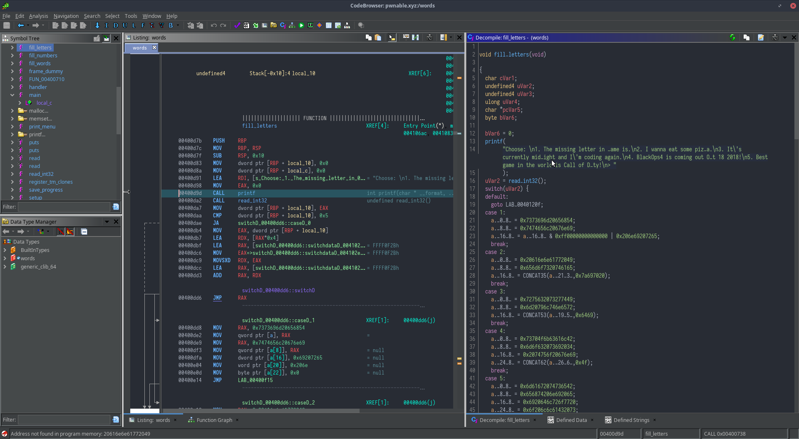

I usually do most of my work during (and throughout) the night, which includes 
using [Ghidra](https://ghidra-sre.org/) for exploiting [pwnable.xyz](https://pwnable.xyz) binaries.

Unfortunately, the default scheme of Ghidra is a light scheme which is quite
glaring in the darkness of my room.


Ghidra does have its own 'dark mode', but it doesn't align with the colorscheme
with the rest of my toolset, which are usually variants of [Solarized](https://ethanschoonover.com/solarized/) or the
[Challenger Deep](https://challenger-deep-theme.github.io/) theme. Furthermore, it is not the most compatible or eye-pleasing.


# Solution

So I began to look for a way to use a better theme and ended up with this [Github issue](https://github.com/NationalSecurityAgency/ghidra/issues/13), which shows how
to use the [Jtattoo](http://www.jtattoo.net/) Look and Feel (LaF). However, it's kinda old and unrefined, so I ended 
searching for other LaFs, and ended using [FlatLaf](https://www.formdev.com/flatlaf/), which hit the mark for me.

::: tip
If you are using Windows instead of Mac/Linux, then look into [Ghidracula](https://digmi.org/2019/03/26/ghidracula/). It doesn't work
on Linux, which is why I ended using alternative methods such as these. There are also LaFs
that might work for you, such as [Quaqua](https://www.randelshofer.ch/quaqua/) if you want that Mac-ish look or [WebLaf](http://weblookandfeel.com/).
:::

## Installing LaFs

The instructions for using a certain LaF for `Ghidra` are in the Github issue above,
but I will give a rehashing here for FlatLaf.

1. Download the jar file for `flatlaf-0.18.jar` from [here](https://bintray.com/jformdesigner/flatlaf/flatlaf/0.18#files/com%2Fformdev%2Fflatlaf%2F0.18) and place it somewhere.
2. Place the path to the jar in the highlighted lines below in `<GHIDRA_PATH>/support/launch.sh`

``` sh{6,13}
SUPPORT_DIR="${0%/*}"
if [ -f "${SUPPORT_DIR}/launch.properties" ]; then

	# Production Environment
	INSTALL_DIR="${SUPPORT_DIR}/.."
	CPATH="${INSTALL_DIR}/Ghidra/Framework/Utility/lib/Utility.jar:<PATH_TO_JAR>"
	LS_CPATH="${SUPPORT_DIR}/LaunchSupport.jar"
	DEBUG_LOG4J="${SUPPORT_DIR}/debug.log4j.xml"
else

	# Development Environment
	INSTALL_DIR="${SUPPORT_DIR}/../../../.."
	CPATH="${INSTALL_DIR}/Ghidra/Framework/Utility/bin/main:<PATH_TO_JAR>"
	LS_CPATH="${INSTALL_DIR}/GhidraBuild/LaunchSupport/bin/main"
	DEBUG_LOG4J="${INSTALL_DIR}/Ghidra/RuntimeScripts/Common/support/debug.log4j.xml"
fi
```

3. Set FlatLaf as the systemlaf. Add this line to `<GHIDRA_PATH>/support/launch.properties`.
```sh
VMARGS=-Dswing.systemlaf=com.formdev.flatlaf.FlatDarkLaf
```
4. Use the System LaF in Ghidra, then restart Ghidra and enjoy! :tada:

<video style="width:100%" controls>
  <source src="./use-system-laf.webm">
  Your browser does not support the video tag.
</video>

## Colourscheme for Code Browser and Listing

However, setting LaF doesn't change the colours of the Code Browser (Decompile Panel) nor the
Listing Panel. So I set them up via `Right Click on Decompile Panel` >` Properties` > `Decompiler>Display`
then configuring the colours there. There are quite a lot of colours, so here is the relevant
`_code_browser.tcd`. 




