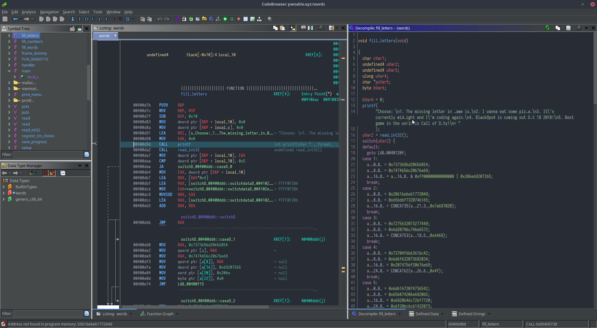

I usually do most of my work during (and throughout) the night, which includes 
using [Ghidra](https://ghidra-sre.org/) for exploiting [pwnable.xyz](https://pwnable.xyz) binaries.

Unfortunately, the default scheme of Ghidra is a light scheme which is quite
glaring in the darkness of my room.


Ghidra does have its own 'dark mode', but it doesn't align with the colorscheme
with the rest of my toolset, which are usually variants of [Solarized](https://ethanschoonover.com/solarized/) or the
[Challenger Deep](https://challenger-deep-theme.github.io/) theme. Furthermore, it is not the most compatible or eye-pleasing.


# Solution

So I began to look for a way to use a better theme and ended up with this [Github issue](https://github.com/NationalSecurityAgency/ghidra/issues/13), which shows how
to use the [Jtattoo](http://www.jtattoo.net/) Look and Feel (LaF). However, it's kinda old and unrefined, so I ended 
searching for other LaFs, and ended using [FlatLaf](https://www.formdev.com/flatlaf/), which hit the mark for me.

::: tip
If you are using Windows instead of Mac/Linux, then look into [Ghidracula](https://digmi.org/2019/03/26/ghidracula/). It doesn't work
on Linux, which is why I ended using alternative methods such as these. There are also LaFs
that might work for you, such as [Quaqua](https://www.randelshofer.ch/quaqua/) if you want that Mac-ish look or [WebLaf](http://weblookandfeel.com/).
:::

## Installing LaFs

The instructions for using a certain LaF for `Ghidra` are in the Github issue above,
but I will give a rehashing here for FlatLaf.

1. Download the jar file for `flatlaf-0.18.jar` from [here](https://bintray.com/jformdesigner/flatlaf/flatlaf/0.18#files/com%2Fformdev%2Fflatlaf%2F0.18) and place it somewhere.
2. Place the path to the jar in the highlighted lines below in `<GHIDRA_PATH>/support/launch.sh`

``` sh{6,13}
SUPPORT_DIR="${0%/*}"
if [ -f "${SUPPORT_DIR}/launch.properties" ]; then

	# Production Environment
	INSTALL_DIR="${SUPPORT_DIR}/.."
	CPATH="${INSTALL_DIR}/Ghidra/Framework/Utility/lib/Utility.jar:<PATH_TO_JAR>"
	LS_CPATH="${SUPPORT_DIR}/LaunchSupport.jar"
	DEBUG_LOG4J="${SUPPORT_DIR}/debug.log4j.xml"
else

	# Development Environment
	INSTALL_DIR="${SUPPORT_DIR}/../../../.."
	CPATH="${INSTALL_DIR}/Ghidra/Framework/Utility/bin/main:<PATH_TO_JAR>"
	LS_CPATH="${INSTALL_DIR}/GhidraBuild/LaunchSupport/bin/main"
	DEBUG_LOG4J="${INSTALL_DIR}/Ghidra/RuntimeScripts/Common/support/debug.log4j.xml"
fi
```

3. Set FlatLaf as the systemlaf. Add this line to `<GHIDRA_PATH>/support/launch.properties`.
```sh
VMARGS=-Dswing.systemlaf=com.formdev.flatlaf.FlatDarkLaf
```
4. Use the System LaF in Ghidra, then restart Ghidra and enjoy! :tada:

<video style="width:100%" controls>
  <source src="./use-system-laf.webm">
  Your browser does not support the video tag.
</video>

## Colourscheme for Code Browser and Listing



However, setting LaF doesn't change the colours of the Code Browser (Decompile Panel) nor the
Listing Panel. So I set them up via `Right Click on Decompile Panel` >` Properties` > `Decompiler>Display`
then configuring the colours there. There are quite a lot of colours, so here is the relevant
`_code_browser.tcd`. 

```xml
...
<CATEGORY NAME="Listing Fields">
  <STATE NAME="Format Code.Flag Function Entry" TYPE="boolean" VALUE="true" />
  <STATE NAME="Format Code.Flag Function Exits" TYPE="boolean" VALUE="true" />
  <STATE NAME="Format Code.Flag Jumps and Returns" TYPE="boolean" VALUE="true" />
  <ENUM NAME="Cursor Text Highlight.Mouse Button To Activate" TYPE="enum" CLASS="ghidra.GhidraOptions$CURSOR_MOUSE_BUTTON_NAMES" VALUE="LEFT" />
  <STATE NAME="Operands Field.Add Space After Separator" TYPE="boolean" VALUE="true" />
  <WRAPPED_OPTION NAME="Cursor Text Highlight.Highlight Color" CLASS="ghidra.framework.options.WrappedColor">
      <STATE NAME="color" TYPE="int" VALUE="-14142899" />
  </WRAPPED_OPTION>
  <WRAPPED_OPTION NAME="Selection Colors.Selection Color" CLASS="ghidra.framework.options.WrappedColor">
      <STATE NAME="color" TYPE="int" VALUE="-13991536" />
  </WRAPPED_OPTION>
  <WRAPPED_OPTION NAME="Selection Colors.Difference Color" CLASS="ghidra.framework.options.WrappedColor">
      <STATE NAME="color" TYPE="int" VALUE="-17289" />
  </WRAPPED_OPTION>
  <WRAPPED_OPTION NAME="Selection Colors.Highlight Color" CLASS="ghidra.framework.options.WrappedColor">
      <STATE NAME="color" TYPE="int" VALUE="-13991536" />
  </WRAPPED_OPTION>
  <WRAPPED_OPTION NAME="Cursor.Highlight Cursor Line Color" CLASS="ghidra.framework.options.WrappedColor">
      <STATE NAME="color" TYPE="int" VALUE="-13991536" />
  </WRAPPED_OPTION>
</CATEGORY>
...
<CATEGORY NAME="Decompiler">
  <STATE NAME="Display.Display EOL comments" TYPE="boolean" VALUE="true" />
  <STATE NAME="Display.Print 'NULL' for null pointers" TYPE="boolean" VALUE="true" />
  <STATE NAME="Display.Display POST comments" TYPE="boolean" VALUE="true" />
  <STATE NAME="Display.Display Namespaces" TYPE="boolean" VALUE="true" />
  <STATE NAME="Display.Comment line indent level" TYPE="int" VALUE="2" />
  <ENUM NAME="Display.Comment style" TYPE="enum" CLASS="ghidra.app.decompiler.DecompileOptions$CommentStyleEnum" VALUE="CPPStyle" />
  <STATE NAME="Display.Display PLATE comments" TYPE="boolean" VALUE="true" />
  <WRAPPED_OPTION NAME="Display.Color for Keywords" CLASS="ghidra.framework.options.WrappedColor">
      <STATE NAME="color" TYPE="int" VALUE="-3832128" />
  </WRAPPED_OPTION>
  <WRAPPED_OPTION NAME="Display.Background Color" CLASS="ghidra.framework.options.WrappedColor">
      <STATE NAME="color" TYPE="int" VALUE="-14144460" />
  </WRAPPED_OPTION>
  <WRAPPED_OPTION NAME="Display.Color for Parameters" CLASS="ghidra.framework.options.WrappedColor">
      <STATE NAME="color" TYPE="int" VALUE="-3770147" />
  </WRAPPED_OPTION>
  <WRAPPED_OPTION NAME="Display.Color for Highlighting Find Matches" CLASS="ghidra.framework.options.WrappedColor">
      <STATE NAME="color" TYPE="int" VALUE="-13991536" />
  </WRAPPED_OPTION>
  <WRAPPED_OPTION NAME="Display.Color for Globals" CLASS="ghidra.framework.options.WrappedColor">
      <STATE NAME="color" TYPE="int" VALUE="-3040666" />
  </WRAPPED_OPTION>
  <WRAPPED_OPTION NAME="Display.Color for Constants" CLASS="ghidra.framework.options.WrappedColor">
      <STATE NAME="color" TYPE="int" VALUE="-6765703" />
  </WRAPPED_OPTION>
  <WRAPPED_OPTION NAME="Display.Color for Current Variable Highlight" CLASS="ghidra.framework.options.WrappedColor">
      <STATE NAME="color" TYPE="int" VALUE="-13991536" />
  </WRAPPED_OPTION>
  <WRAPPED_OPTION NAME="Display.Color Default" CLASS="ghidra.framework.options.WrappedColor">
      <STATE NAME="color" TYPE="int" VALUE="-5524801" />
  </WRAPPED_OPTION>
  <WRAPPED_OPTION NAME="Display.Color for Types" CLASS="ghidra.framework.options.WrappedColor">
      <STATE NAME="color" TYPE="int" VALUE="-1720197" />
  </WRAPPED_OPTION>
  <WRAPPED_OPTION NAME="Display.Color for Variables" CLASS="ghidra.framework.options.WrappedColor">
      <STATE NAME="color" TYPE="int" VALUE="-2069387" />
  </WRAPPED_OPTION>
  <WRAPPED_OPTION NAME="Display.Color for Comments" CLASS="ghidra.framework.options.WrappedColor">
      <STATE NAME="color" TYPE="int" VALUE="-10722448" />
  </WRAPPED_OPTION>
  ...
  <WRAPPED_OPTION NAME="Display.Color for Function names" CLASS="ghidra.framework.options.WrappedColor">
      <STATE NAME="color" TYPE="int" VALUE="-10375185" />
  </WRAPPED_OPTION>
</CATEGORY>

...
<CATEGORY NAME="Listing Display">
  <STATE NAME="Mnemonic Style" TYPE="int" VALUE="1" />
  <STATE NAME="Mnemonic, Override Style" TYPE="int" VALUE="3" />
  <STATE NAME="Bytes Style" TYPE="int" VALUE="1" />
  <WRAPPED_OPTION NAME="Background Color" CLASS="ghidra.framework.options.WrappedColor">
      <STATE NAME="color" TYPE="int" VALUE="-14144460" />
  </WRAPPED_OPTION>
  <WRAPPED_OPTION NAME="Mnemonic Color" CLASS="ghidra.framework.options.WrappedColor">
      <STATE NAME="color" TYPE="int" VALUE="-10112257" />
  </WRAPPED_OPTION>
  <WRAPPED_OPTION NAME="BASE FONT" CLASS="ghidra.framework.options.WrappedFont">
      <STATE NAME="size" TYPE="int" VALUE="13" />
      <STATE NAME="style" TYPE="int" VALUE="0" />
      <STATE NAME="family" TYPE="string" VALUE="Iosevka Nerd Font" />
  </WRAPPED_OPTION>
  <WRAPPED_OPTION NAME="XRef Write Color" CLASS="ghidra.framework.options.WrappedColor">
      <STATE NAME="color" TYPE="int" VALUE="-1224910" />
  </WRAPPED_OPTION>
  <WRAPPED_OPTION NAME="Address Color" CLASS="ghidra.framework.options.WrappedColor">
      <STATE NAME="color" TYPE="int" VALUE="-5524801" />
  </WRAPPED_OPTION>
  <WRAPPED_OPTION NAME="Function Parameters Color" CLASS="ghidra.framework.options.WrappedColor">
      <STATE NAME="color" TYPE="int" VALUE="-32640" />
  </WRAPPED_OPTION>
  <WRAPPED_OPTION NAME="Function Return Type Color" CLASS="ghidra.framework.options.WrappedColor">
      <STATE NAME="color" TYPE="int" VALUE="-32640" />
  </WRAPPED_OPTION>
  <WRAPPED_OPTION NAME="Constant Color" CLASS="ghidra.framework.options.WrappedColor">
      <STATE NAME="color" TYPE="int" VALUE="-10301034" />
  </WRAPPED_OPTION>
  <WRAPPED_OPTION NAME="XRef Other Color" CLASS="ghidra.framework.options.WrappedColor">
      <STATE NAME="color" TYPE="int" VALUE="-17" />
  </WRAPPED_OPTION>
  <WRAPPED_OPTION NAME="EOL Comment Color" CLASS="ghidra.framework.options.WrappedColor">
      <STATE NAME="color" TYPE="int" VALUE="-10722448" />
  </WRAPPED_OPTION>
  <WRAPPED_OPTION NAME="Labels, Primary Color" CLASS="ghidra.framework.options.WrappedColor">
      <STATE NAME="color" TYPE="int" VALUE="-6946908" />
  </WRAPPED_OPTION>
  <WRAPPED_OPTION NAME="Function Tag Color" CLASS="ghidra.framework.options.WrappedColor">
      <STATE NAME="color" TYPE="int" VALUE="-8224516" />
  </WRAPPED_OPTION>
  <WRAPPED_OPTION NAME="Bytes Color" CLASS="ghidra.framework.options.WrappedColor">
      <STATE NAME="color" TYPE="int" VALUE="-10375185" />
  </WRAPPED_OPTION>
  <WRAPPED_OPTION NAME="Post-Comment Color" CLASS="ghidra.framework.options.WrappedColor">
      <STATE NAME="color" TYPE="int" VALUE="-10722448" />
  </WRAPPED_OPTION>
  <WRAPPED_OPTION NAME="Function Call-Fixup Color" CLASS="ghidra.framework.options.WrappedColor">
      <STATE NAME="color" TYPE="int" VALUE="-11840925" />
  </WRAPPED_OPTION>
  <WRAPPED_OPTION NAME="Plate Comment Color" CLASS="ghidra.framework.options.WrappedColor">
      <STATE NAME="color" TYPE="int" VALUE="-10722448" />
  </WRAPPED_OPTION>
  <WRAPPED_OPTION NAME="Labels, Unreferenced Color" CLASS="ghidra.framework.options.WrappedColor">
      <STATE NAME="color" TYPE="int" VALUE="-7312129" />
  </WRAPPED_OPTION>
  <WRAPPED_OPTION NAME="Entry Point Color" CLASS="ghidra.framework.options.WrappedColor">
      <STATE NAME="color" TYPE="int" VALUE="-10112257" />
  </WRAPPED_OPTION>
  <WRAPPED_OPTION NAME="Pre-Comment Color" CLASS="ghidra.framework.options.WrappedColor">
      <STATE NAME="color" TYPE="int" VALUE="-10722448" />
  </WRAPPED_OPTION>
  <WRAPPED_OPTION NAME="Mnemonic, Override Color" CLASS="ghidra.framework.options.WrappedColor">
      <STATE NAME="color" TYPE="int" VALUE="-10112257" />
  </WRAPPED_OPTION>
  <WRAPPED_OPTION NAME="Parameter, Dynamic Storage Color" CLASS="ghidra.framework.options.WrappedColor">
      <STATE NAME="color" TYPE="int" VALUE="-32640" />
  </WRAPPED_OPTION>
  <WRAPPED_OPTION NAME="Parameter, Custom Storage Color" CLASS="ghidra.framework.options.WrappedColor">
      <STATE NAME="color" TYPE="int" VALUE="-32640" />
  </WRAPPED_OPTION>
  <WRAPPED_OPTION NAME="Registers Color" CLASS="ghidra.framework.options.WrappedColor">
      <STATE NAME="color" TYPE="int" VALUE="-43944" />
  </WRAPPED_OPTION>
  <WRAPPED_OPTION NAME="Labels, Non-primary Color" CLASS="ghidra.framework.options.WrappedColor">
      <STATE NAME="color" TYPE="int" VALUE="-7312129" />
  </WRAPPED_OPTION>
  <WRAPPED_OPTION NAME="XRef, Offcut Color" CLASS="ghidra.framework.options.WrappedColor">
      <STATE NAME="color" TYPE="int" VALUE="-16711714" />
  </WRAPPED_OPTION>
  <WRAPPED_OPTION NAME="Field Name Color" CLASS="ghidra.framework.options.WrappedColor">
      <STATE NAME="color" TYPE="int" VALUE="-5524801" />
  </WRAPPED_OPTION>
  <WRAPPED_OPTION NAME="XRef Read Color" CLASS="ghidra.framework.options.WrappedColor">
      <STATE NAME="color" TYPE="int" VALUE="-16744753" />
  </WRAPPED_OPTION>
  <WRAPPED_OPTION NAME="Separator Color" CLASS="ghidra.framework.options.WrappedColor">
      <STATE NAME="color" TYPE="int" VALUE="-5524801" />
  </WRAPPED_OPTION>
  <WRAPPED_OPTION NAME="Function Auto-Parameters Color" CLASS="ghidra.framework.options.WrappedColor">
      <STATE NAME="color" TYPE="int" VALUE="-32640" />
  </WRAPPED_OPTION>
  <WRAPPED_OPTION NAME="Comment, Automatic Color" CLASS="ghidra.framework.options.WrappedColor">
      <STATE NAME="color" TYPE="int" VALUE="-10710629" />
  </WRAPPED_OPTION>
  <WRAPPED_OPTION NAME="XRef Color" CLASS="ghidra.framework.options.WrappedColor">
      <STATE NAME="color" TYPE="int" VALUE="-16711714" />
  </WRAPPED_OPTION>
  <WRAPPED_OPTION NAME="Variable Color" CLASS="ghidra.framework.options.WrappedColor">
      <STATE NAME="color" TYPE="int" VALUE="-5718" />
  </WRAPPED_OPTION>
  <WRAPPED_OPTION NAME="Flow Arrow, Active Color" CLASS="ghidra.framework.options.WrappedColor">
      <STATE NAME="color" TYPE="int" VALUE="-6266947" />
  </WRAPPED_OPTION>
  <WRAPPED_OPTION NAME="Labels, Local Color" CLASS="ghidra.framework.options.WrappedColor">
      <STATE NAME="color" TYPE="int" VALUE="-3770147" />
  </WRAPPED_OPTION>
  <WRAPPED_OPTION NAME="Function Name Color" CLASS="ghidra.framework.options.WrappedColor">
      <STATE NAME="color" TYPE="int" VALUE="-10375185" />
  </WRAPPED_OPTION>
</CATEGORY>
```

## Conclusion
Setting up the colours requires a lot of manual fiddling and google-fu (and yak shaving if you're unlucky).
Hopefully this post has helped to ease the pain and suffering of setting up a colorscheme. Enjoy this theme
and take care of your eyesight!
