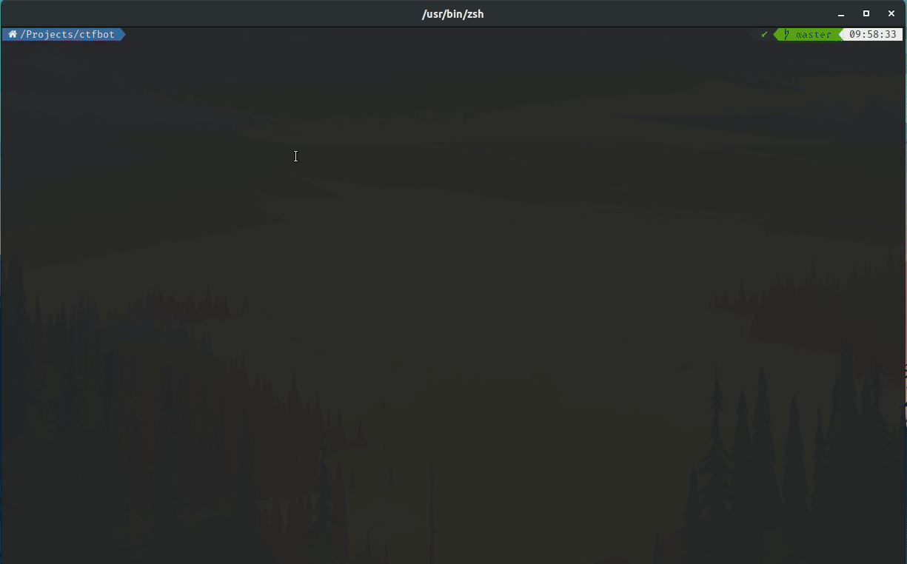
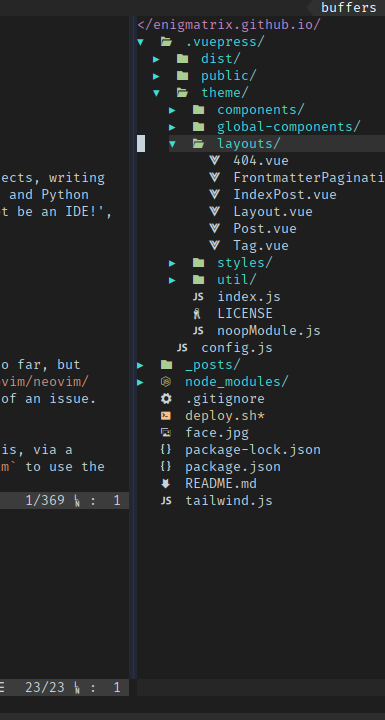
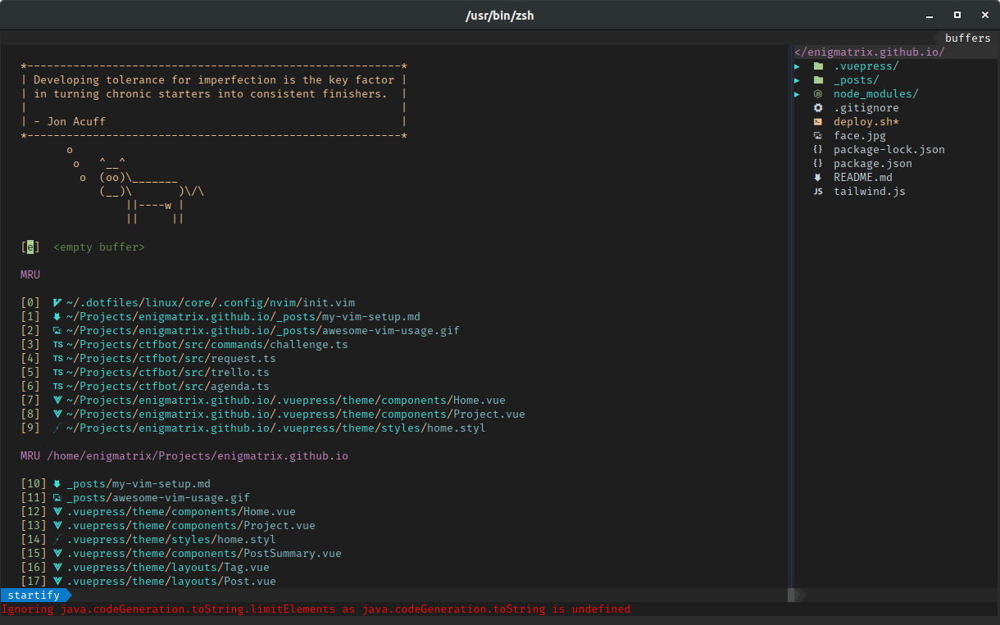
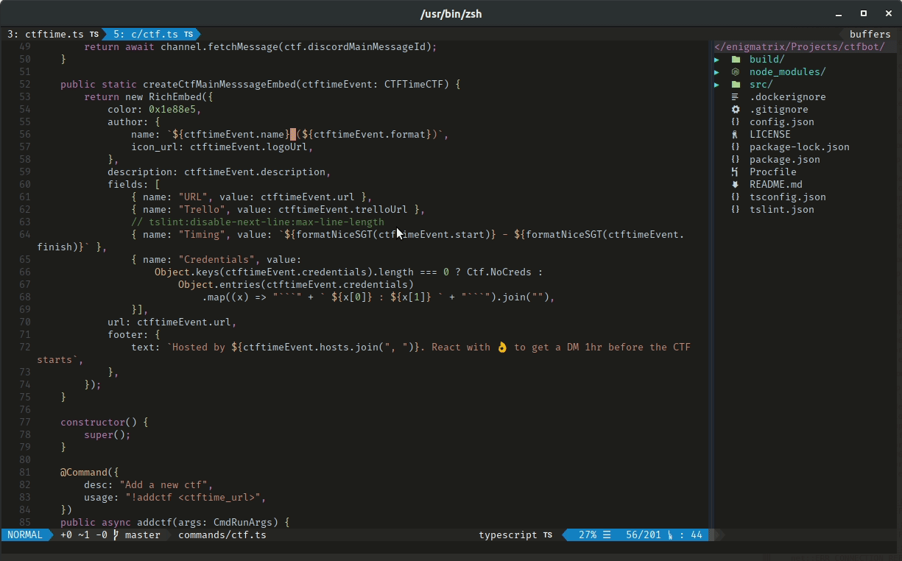
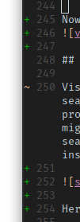
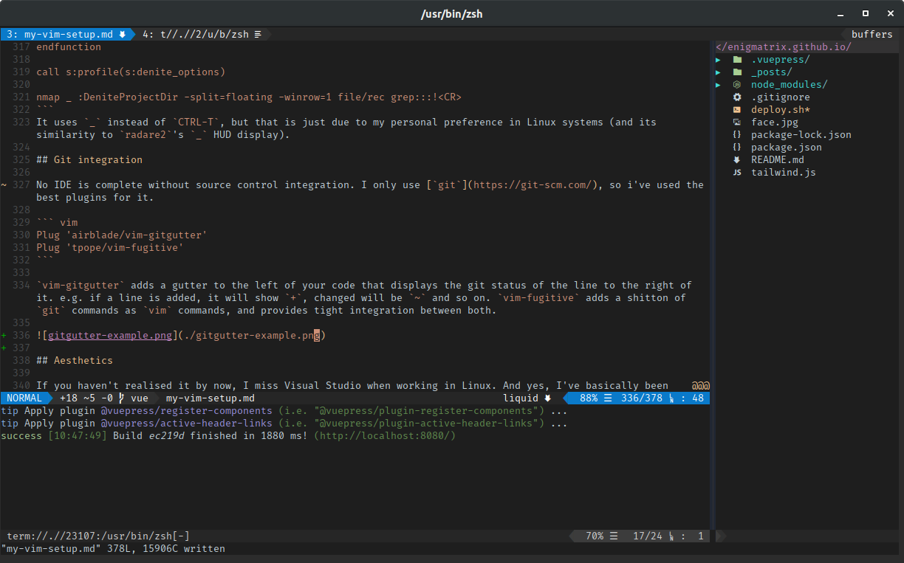

`Vim` is probably one of the most powerful text editors out there. I use it for working on my projects, writing quick scripts, and even writing this blog post. I've setup my `vim` to be a JavaScript, TypeScript and Python IDE, without much performance degradation. 'How is that even possible?', you might ask. 'Vim cannot be an IDE!', shouts the unconvinced watcher. Well, heres my `vim`:



So, just read on :smiley:

## Let's Start!

First things first, ditch the default `vim`. Yes, I know I've been touting the benefits of `vim` so far, but theres a better alternative: `neovim`. Use the unstable build of [`neovim`](https://github.com/neovim/neovim/releases) (atleast `0.4`). It is much faster and has more features, and the bugs are not that big of an issue. Run `:checkhealth` and get the `python` and `node` support working.

Even the default `neovim` needs to be extended to fit our needs of an IDE. We use plugins to do this, via a plugin manager called [vim-plug](https://github.com/junegunn/vim-plug). Let's configure our `neovim` to use the plugin manager.

``` vim
" vim-plug auto setup
let plugpath = expand('<sfile>:p:h'). '/autoload/plug.vim'
if !filereadable(plugpath)
    if executable('curl')
        let plugurl = 'https://raw.githubusercontent.com/junegunn/vim-plug/master/plug.vim'
        call system('curl -fLo ' . shellescape(plugpath) . ' --create-dirs ' . plugurl)
        if v:shell_error
            echom "Error downloading vim-plug. Please install it manually.\n"
            exit
        endif
    else
        echom "vim-plug not installed. Please install it manually or install curl.\n"
        exit
    endif
endif

call plug#begin('~/.local/share/nvim/plugged')

" Plugins go here like this:
" Plug '<link>'

call plug#end()

" General Settings
" Do not worry too much about what this does, I don't have a clue either :^)
filetype plugin indent on
syntax on
set encoding=utf-8
set tabstop=2
set expandtab
set autoindent
set shiftwidth=2
set scrolloff=3
set showcmd
set hidden
set wildmenu
set visualbell
set splitbelow
set ttyfast
set ruler
set backspace=indent,eol,start
set number
set ignorecase
set smartcase
set gdefault
set incsearch
set showmatch
set hlsearch
set wrap
set linebreak
set nolist
set shortmess+=c

" rest of the configuration goes here
```

Put the above code into the `neovim` configuration file, usually `~/.config/nvim/init.vim`. Code (written in VimL) in the file is loaded on startup to initialize our `neovim` to our liking. We will be adding almost all our configuration to this file, so keep note. Next, its time to go shopping for plugins!

There are quite a lot of plugins available to `vim`, and by extension, `neovim`. The best place to find them is usually through [VimAwesome](https://vimawesome.com/), but today I'm focusing on the bare minimum of the IDE experience. Let's install some completion and syntax highlighting.

## Completion and Syntax Highlighting
Add these lines to the plugins list:
``` vim
Plug 'neoclide/coc.nvim', {'do': { -> coc#util#install() }}
Plug 'sheerun/vim-polyglot'
```
The first plugin is called [`coc`](https://github.com/neoclide/coc.nvim), which is our completion engine. It is currently the best asynchronous completion engine for JavaScript and TypeScript, due to the reason that it's based off `Language Server Protocol`. This is what [Visual Studio Code](https://code.visualstudio.com/) uses internally for its completion, and `coc` extends this by also providing `neovim` with both completion and refactoring actions, such as **go to definition**, **go to references**, **rename** and many others, including language-specific actions such as **sort-imports** for python. All in all, it is one of the hottest plugins for making your `vim` into an IDE! Remember to go over to the extension's site and follow the additional install instructions too.

For our syntax highlighting needs, we have `vim-polyglot`, which provides syntax files for a variety of languages. 'Nuff said :stuck_out_tongue:

At this point in time, if you load up a JavaScript project, you will still see no completions. You need to actually install your plugins first! Do this via `:PlugInstall`. Next up, you will need to install `coc` extensions, which are the actual packages that provide access to a language's `Language Server Protocol`. Here is an example:

``` vim
let g:coc_global_extensions = ["coc-css",
            \ "coc-eslint",
            \ "coc-html",
            \ "coc-json",
            \ "coc-prettier",
            \ "coc-python",
            \ "coc-tslint",
            \ "coc-tsserver",
            \ "coc-ultisnips",
            \ "coc-tailwindcss",
            \ "coc-vetur"]
```

Adding the above lines to your config file will make it install the extensions automatically. Now, open your JavaScript project and watch the magic :sunglasses:

`coc` can be configured even further! Add a file called `~/.config/nvim/coc-settings.json` and put this in:

``` json
{
  "suggest.maxCompleteItemCount": 20,
  "eslint.filetypes": [
    "javascript",
    "typescript",
    "typescriptreact",
    "javascriptreact"
  ],
  "diagnostic.infoSign": "ღ",
  "diagnostic.hintSign": "ஐ",
  "diagnostic.warningSign": "⚠",
  "diagnostic.errorSign": "✖",
  "diagnostic.enable": true,
  "diagnostic.signOffset": 9999999,
  "diagnostic.highlightOffset": 9999999,
  "diagnostic.refreshOnInsertMode": true,
  "suggest.completionItemKindLabels": {
    "keyword": "\uf1de",
    "variable": "\ue79b",
    "value": "\uf89f",
    "operator": "\u03a8",
    "function": "\u0192",
    "reference": "\ufa46",
    "constant": "\uf8fe",
    "method": "\uf09a",
    "struct": "\ufb44",
    "class": "\uf0e8",
    "interface": "\uf417",
    "text": "\ue612",
    "enum": "\uf435",
    "enumMember": "\uf02b",
    "module": "\uf40d",
    "color": "\ue22b",
    "property": "\ue624",
    "field": "\uf9be",
    "unit": "\uf475",
    "event": "\ufacd",
    "file": "\uf723",
    "folder": "\uf114",
    "snippet": "\ue60b",
    "typeParameter": "\uf728",
    "default": "\uf29c"
  },
  "python.pythonPath": "python"
}
```

This will give better glyphs in the side gutter, and give better icons in the completion popup menu (the default is just letters, e.g. `v` for value, `f` for function).

## File Explorer With Icons

What IDE doesn't have a file explorer? I've always missed Visual Studio's Solution Explorer while using Vim, and `netrw`, the default file explorer, is pretty clunky, and theres no icons. Luckily for me, theres `nerdtree` ! Add these plugins:

``` vim
Plug 'scrooloose/nerdtree'
Plug 'ryanoasis/vim-devicons'
```

Note that you have will also have to install and set your terminal font to one of the available [nerd-fonts](https://github.com/ryanoasis/nerd-fonts) so that the icons will appear. I personally use [FuraCode](https://github.com/ryanoasis/nerd-fonts/tree/master/patched-fonts/FiraCode), which has ligatures for programming languages (needs terminal support, of course). Here is the configuration for the plugins:

``` vim
let g:NERDTreeShowHidden = 1
let g:NERDTreeMinimalUI = 1
let g:NERDTreeWinPos = 'rightbelow'
let g:NERDTreeIgnore = ['^\.DS_Store$', '^tags$', '\.git$[[dir]]', '\.idea$[[dir]]', '\.sass-cache$']
let g:NERDTreeStatusline = ''
" Automaticaly close nvim if NERDTree is only thing left open
autocmd bufenter * if (winnr("$") == 1 && exists("b:NERDTree") && b:NERDTree.isTabTree()) | q | endif

" vim-devicons
let g:webdevicons_enable = 1
let g:webdevicons_enable_nerdtree = 1
let g:webdevicons_enable_unite = 1
let g:webdevicons_enable_vimfiler = 1
let g:webdevicons_enable_airline_tabline = 1
let g:webdevicons_enable_airline_statusline = 1
let g:webdevicons_enable_ctrlp = 1
let g:webdevicons_enable_flagship_statusline = 1
let g:WebDevIconsUnicodeDecorateFileNodes = 1
let g:WebDevIconsUnicodeGlyphDoubleWidth = 1
let g:webdevicons_conceal_nerdtree_brackets = 1
let g:WebDevIconsNerdTreeAfterGlyphPadding = '  '
let g:WebDevIconsNerdTreeGitPluginForceVAlign = 1
let g:webdevicons_enable_denite = 1
let g:WebDevIconsUnicodeDecorateFolderNodes = 1
let g:DevIconsEnableFoldersOpenClose = 1
let g:DevIconsEnableFolderPatternMatching = 1
let g:DevIconsEnableFolderExtensionPatternMatching = 1
let WebDevIconsUnicodeDecorateFolderNodesExactMatches = 1
```

After that, you can run `:NERDTreeToggle` to toggle your 'file explorer' window on and off.



## Status bar and Startup page

You have probably seen fancy powerline-style status bars being used in [/r/vimporn](https://reddit.com/r/vimporn), and of course, I use it too. Also, what good is an IDE without a Startup page?

``` vim
Plug 'vim-airline/vim-airline'
Plug 'mhinz/vim-startify'
```

Here's all the configs needed:

``` vim
" Startify then NERDTree, on startup
autocmd VimEnter *
                \   if !argc()
                \ |   Startify
                \ |   NERDTree
                \ |   wincmd w
                \ | endif


" air-line
let g:airline_powerline_fonts = 1
let g:airline_extensions = ['branch', 'hunks', 'coc', 'tabline']
let g:airline#extensions#tabline#formatter = 'unique_tail_improved'
let g:airline#extensions#tabline#buffer_nr_show = 1
let g:airline#extensions#default#layout = [['a', 'b', 'c'], ['x', 'z', 'warning', 'error']]
let g:airline_skip_empty_sections = 1
let airline#extensions#coc#stl_format_err = '%E{[%e(#%fe)]}'
let airline#extensions#coc#stl_format_warn = '%W{[%w(#%fw)]}'
" Configure error/warning section to use coc.nvim
let g:airline_section_error = '%{airline#util#wrap(airline#extensions#coc#get_error(),0)}'
let g:airline_section_warning = '%{airline#util#wrap(airline#extensions#coc#get_warning(),0)}'
"let g:airline_theme = '<set to something sexy>'

```

Now, if you open up your `vim` with no arguments, you can see this:


## Searching

Visual Studio with [Resharper](https://www.jetbrains.com/resharper/) had this awesome feature: global fuzzy search with `CTRL+T`. You can search absolutely anything, from files to even text in files, across the entire project. We can make `neovim` have this feature too, via `denite`. However, for in-file searching, the above might be overkill, and might actually slow you down with too may results. We should aim to use the default vim search, `/<search>` for it. We will be enhancing it, of course :smile:, with `incsearch`, which highlights all instances of the search term, as you type the term. Here is an example of what I mean:



Here are the necessary plugin lines to replicate that:

``` vim
Plug 'haya14busa/incsearch.vim'
Plug 'Shougo/denite.nvim'
```

`denite` is quite complicated to setup, and I've made it even more complicated by using `ripgrep`, the fastest grep clone right now (written in Rust, by the way). Go ahead and install [`ripgrep`](https://github.com/BurntSushi/ripgrep), then use this configuration:

``` vim
" Denite
call denite#custom#var('file/rec', 'command', ['rg', '--hidden', '--files', '--glob', '!.git'])
"
call denite#custom#var('grep', 'command', ['rg'])
call denite#custom#var('grep', 'default_opts', ['--smart-case', '--follow', '--hidden', '--vimgrep', '--heading'])
call denite#custom#var('grep', 'recursive_opts', [])
call denite#custom#var('grep', 'pattern_opt', ['--regexp'])
call denite#custom#var('grep', 'separator', ['--'])
call denite#custom#var('grep', 'final_opts', [])

call denite#custom#map(
	      \ 'insert',
	      \ '<Down>',
	      \ '<denite:move_to_next_line>',
	      \ 'noremap'
	      \)
call denite#custom#map(
	      \ 'insert',
	      \ '<Up>',
	      \ '<denite:move_to_previous_line>',
	      \ 'noremap'
	      \)

" Remove date from buffer list
call denite#custom#var('buffer', 'date_format', '')

" Custom options for Denite
"   auto_resize             - Auto resize the Denite window height automatically.
"   prompt                  - Customize denite prompt
"   direction               - Specify Denite window direction as directly below current pane
"   winminheight            - Specify min height for Denite window
"   highlight_mode_insert   - Specify h1-CursorLine in insert mode
"   prompt_highlight        - Specify color of prompt
"   highlight_matched_char  - Matched characters highlight
"   highlight_matched_range - matched range highlight
let s:denite_options = {'default' : {
\ 'auto_resize': 1,
\ 'direction': 'rightbelow',
\ 'winminheight': '10',
\ 'highlight_mode_insert': 'Visual',
\ 'highlight_mode_normal': 'Visual',
\ 'prompt_highlight': 'Function',
\ 'highlight_matched_char': 'Function',
\ 'highlight_matched_range': 'Normal'
\ }}

" Loop through denite options and enable them
function! s:profile(opts) abort
  for l:fname in keys(a:opts)
    for l:dopt in keys(a:opts[l:fname])
      call denite#custom#option(l:fname, l:dopt, a:opts[l:fname][l:dopt])
    endfor
  endfor
endfunction

call s:profile(s:denite_options)

nmap _ :DeniteProjectDir -split=floating -winrow=1 file/rec grep:::!<CR>
```
It uses `_` instead of `CTRL-T`, but that is just due to my personal preference in Linux systems (and its similarity to `radare2`'s `_` HUD display).

## Git integration

No IDE is complete without source control integration. I only use [`git`](https://git-scm.com/), so i've used the best plugins for it.

``` vim
Plug 'airblade/vim-gitgutter'
Plug 'tpope/vim-fugitive'
```

`vim-gitgutter` adds a gutter to the left of your code that displays the git status of the line to the right of it. e.g. if a line is added, it will show `+`, changed will be `~` and so on. `vim-fugitive` adds a shitton of `git` commands as `vim` commands, and provides tight integration between both.



## Aesthetics

If you haven't realised it by now, I miss Visual Studio when working in Linux. And yes, I've basically been trying to recreate Visual Studio in `vim` this entire blog post. And you've been here, reading through it all.
::: warning
I've got you, hook, line and sinker
::: 
Anyway, let's make it _look_ like Visual Studio too. Add these plugins:

``` vim
Plug 'tomasiser/vim-code-dark'
Plug 'mg979/vim-studio-dark'
```

Next, set up the background as such:

``` vim

" background
if (has("nvim"))
    "For Neovim 0.1.3 and 0.1.4 < https://github.com/neovim/neovim/pull/2198 >
    let $NVIM_TUI_ENABLE_TRUE_COLOR=1
  endif
  "For Neovim > 0.1.5 and Vim > patch 7.4.1799 < https://github.com/vim/vim/commit/61be73bb0f965a895bfb064ea3e55476ac175162 >
  "Based on Vim patch 7.4.1770 (`guicolors` option) < https://github.com/vim/vim/commit/8a633e3427b47286869aa4b96f2bfc1fe65b25cd >
  " < https://github.com/neovim/neovim/wiki/Following-HEAD#20160511 >
  if (has("termguicolors"))
    set termguicolors
  endif
"set background=dark
set t_Co=256
set t_ut=
colorscheme vsdark

let g:airline_theme = 'codedark'
let g:Vsd.contrast = 2  " high
```



Look at that :open_mouth:, doesn't it look just like Visual Studio ~~Code~~? Besides, with all the functionality available, I can honestly say that it feels just like Visual Studio (well, Visual Studio Code only, really), but with a better editing experience and with smoother performance.

## Conclusion
Honestly, I don't think anyone would want to recreate the entirety of my setup. It might bring too many bad memories to people who have converted to `vim` in Linux from actual IDEs in Windows. Just in case there actually are, here are my [dotfiles](https://github.com/Enigmatrix/dotfiles), and you can find my actual [inti.vim](https://github.com/Enigmatrix/dotfiles/blob/master/linux/core/.config/nvim/init.vim) there. There are keymappings there, too, along with other plugins such as `UltiSnips` and convenience features.
